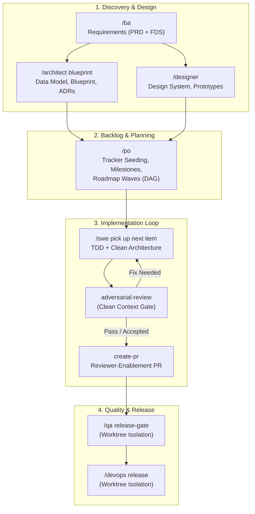

# Skills to Pay the AI Bills

A library of composable **Agent Skills** — `SKILL.md` definitions that an AI coding agent loads on demand to take on a specific, repeatable job: auditing a codebase, running a requirements interview, teaching you a language, keeping you sharp while it builds, and more.

Skills are compatible with **opencode**, **Claude**, and any `.agents`-compatible runtime. They range from small shared *contracts* (a fixed vocabulary, a markup token set) up to full interactive *workflows* with their own slash commands.

---

## Install

Each skill is a folder containing a `SKILL.md`. Copy or symlink the folders you want into one of the locations the agent searches:

| Scope | opencode | Claude | agents |
| :-- | :-- | :-- | :-- |
| Project | `.opencode/skills/<name>/` | `.claude/skills/<name>/` | `.agents/skills/<name>/` |
| Global | `~/.config/opencode/skills/<name>/` | `~/.claude/skills/<name>/` | `~/.agents/skills/<name>/` |

```sh
# Install everything globally for any agent
cp -R skills/* ~/.agents/skills/

# …or symlink a single skill (handy while iterating)
ln -s "$PWD/skills/teach-me" ~/.config/opencode/skills/teach-me
```

Rules that matter for discovery:

- Keep each skill's folder name exactly as-is — it must equal the `name` in its frontmatter and match `^[a-z0-9]+(-[a-z0-9]+)*$`.
- Discovery is **flat** (`skills/*/SKILL.md`); do **not** nest skills inside category sub-folders or they won't be found.
- `SKILL.md` must be upper-case, and `name` must be unique across every install location.

---

## How invocation works

1. **Just ask.** The agent sees every installed skill's name + description and loads the right one with its `skill` tool when your request matches — e.g. *"audit this repo's health"*, *"teach me Rust"*, *"keep me sharp while we build this"*.
2. **Steer with slash commands.** Interactive skills define commands you type mid-session (see [Interactive commands](#interactive-commands)).
3. **Some skills are plumbing.** Shared contracts and leaf skills are pulled in by *other* skills; you rarely invoke them directly.

---

## Development lifecycle & persona workflows

The persona orchestrators (`ba`, `architect`, `designer`, `po`, `swe`, `qa`, `devops`) form a structured, end-to-end software delivery pipeline. Rather than guessing which skill to invoke next, follow the lifecycle sequences below for greenfield builds, brownfield systems, scope changes, and hotfixes.

### The persona chain at a glance



---

### 1. Greenfield workflow (zero to production)

When starting a project from scratch, follow this exact sequence:

1. **Requirements Discovery (`/ba <project idea>`)**
   - Conducts single-session interactive elicitation via `interview-me` and two-stream discovery via `gather-requirements`.
   - Produces `docs/requirements/product-requirements.md` (PRD with Epics, User Stories, and MoSCoW priorities) and `docs/requirements/functional-requirements.md` (FDS with validation rules, exceptions, and behavioural contracts).

2. **System Architecture & Data Modeling (`/architect blueprint`)**
   - Ingests PRD and FDS.
   - **System Blueprint:** Decomposes Module topology, assigns Clean Architecture layers, identifies external Seams and Adapters, and persists the macro architecture to `docs/architecture/system-blueprint.md` (featuring the Module Interdependency Map §2.2 and Seam Topology & Test Placement §2.3.2).
   - **Data Model:** Normalises the persistence layer using `db-normalisation` (UNF → 3NF/BCNF) into `docs/architecture/data-model.md` with Mermaid ER diagrams and data dictionaries.
   - **Decisions & Contracts:** Logs project ADRs (`docs/adr/ADR-XXXX.md`) and enriches `docs/requirements/functional-requirements.md` technical contracts with resolved Module paths and Seam Adapter interfaces.

> **Decision Point: Why `/architect` (and `/designer`) before `/po`?**
>
> If you have just completed `/ba`, **always run `/architect` (and `/designer` if building a UI) before invoking `/po`**.
>
> - **Enriched Issue Bodies without Drift:** When `/po` seeds work items (`create-epic` and `create-user-story`), it copies the traced FDS technical contracts directly into the issue description. Because `/architect` already persisted the Module boundaries, Seam interfaces, and schemas into `system-blueprint.md` and `data-model.md`, the PO does not infer anything—tickets carry authoritative contracts from day one.
> - **SWE Ingests Authoritative Files Directly:** When `/swe` implements a story, it does not rely solely on tracker ticket descriptions. SWE directly loads `docs/architecture/system-blueprint.md`, `docs/architecture/data-model.md`, and `docs/adr/` from the repository, ensuring zero drift between macro design and code.
> - **Accurate Execution Ordering:** When `/po` plans execution waves (`docs/requirements/roadmap.md`), knowing the data model and architecture allows the dependency DAG to correctly place foundational persistence and schemas into Wave 1, core domain logic into Wave 2, and dependent integration layers into later waves.
> - **Idempotence Safety Net:** If you accidentally run `/po` first, nothing is broken: all persona skills use stable-ID markers (`skills:work-item`) and amend items in-place on subsequent runs without creating duplicate tickets.

3. **Design System & Interactive Prototypes (`/designer` — *if frontend/UI exists*)**
   - `/designer system init`: Establishes offline design tokens, stylesheets, icon sprites, and component catalogs in `docs/design/system/v1/`.
   - `/designer design <EPIC-### | STORY-###>`: Synthesises self-contained accessible prototypes (`prototype-ui`), conducts interactive screen walkthroughs, passes the WCAG 2.2 accessibility gate, promotes to `docs/design/approved/`, and hands off UI edge-case gaps to the backlog.

4. **Backlog Seeding & Roadmap Sequencing (`/po`)**
   - Run `/po seed backlog from PRD` and `/po plan execution order`.
   - Probes tracker platform capabilities (GitHub, GitLab, etc.) via `resolve-repository-platform`.
   - Reads PRD, FDS, data model, and approved designs to seed or reconcile Epics (`create-epic`), User Stories (`create-user-story`), and release Milestones (`create-milestone`).
   - Produces `docs/requirements/roadmap.md` with strict dependency DAG edges (`->`, `<-`, `~>`) grouped into parallelisable execution waves (`### W 1`, `### W 2`, …).

5. **Implementation Loop (`/swe`)**
   - Run `/swe pick up next item from plan` (or filter by milestone: `/swe pick up next item from milestone MS-001`).
   - Acquires distributed lock on the tracker work item, reviews architectural contracts and prototypes, and implements the feature using `red-green-refactor-tdd`, `clean-architecture`, and `solid-principles`.
   - Auto-spawns `adversarial-review` in clean context. Surfaces findings for developer decision (fix & re-review or accept & proceed).
   - Spawns `create-pr` to raise an evidence-backed Change Proposal on the platform.
   - Closes the tracker work item upon successful completion.

6. **Quality Assurance Gate (`/qa release-gate`)**
   - Operates entirely inside an isolated git worktree so your working tree is untouched.
   - Runs `audit-test-coverage` and `audit-security-and-governance` in parallel to verify total surface coverage, Seam mocking, and OWASP/GDPR compliance.

7. **Release & Deployment (`/devops release <version>`)**
   - Operates in an isolated git worktree.
   - Bumps version files, generates high-density release notes via `generate-release-notes`, tags the release, verifies CI/CD pipeline triggers, and raises Change Proposals merging the release into `main` and `develop`.

---

### 2. Brownfield workflow (existing or inherited codebases)

When bringing an existing codebase under structured governance or before embarking on major feature work:

1. **System Blueprinting (`/architect analyze`)**
   - Spawns `analyze-a-codebase` to reverse-engineer physical source code into `docs/architecture/system-blueprint.md`, mapping functional domains to directories and documenting existing Seams.

2. **Quality & Security Baseline (`/qa release-gate`)**
   - Runs in an isolated worktree to baseline existing test coverage deficits, brittle tests, secret leaks, and security exposures without risking changes to active files.

3. **Requirements Reconstruction (`/ba`)**
   - Runs `gather-requirements` in reverse-engineer origin.
   - Parses source code, commit history, and existing issue trackers to synthesize draft PRD and FDS documents. Every item carries a `[Confidence: Level]` tag and source provenance.
   - Conducts a targeted confirmation interview solely on low-confidence findings and gaps.

4. **Backlog Reconciliation & Remediation Roadmap (`/po reconcile`)**
   - Ingests the reconstructed PRD/FDS, queries active tracker tickets, identifies duplicates, orphans, and drift, and groups critical remediation and technical debt into early roadmap waves (`docs/requirements/roadmap.md`).

5. **Plan-Driven Feature Delivery & Refactoring (`/swe` or `/refactor`)**
   - Safely remediate architectural drift or build new features with full context, verified Seams, and TDD protection.

---

### 3. Scope changes & mid-flight feature additions

When product scope shifts during active development:

1. **Amend Requirements (`/ba`)**
   - Re-invoke `/ba` to update the PRD and FDS. Existing stable IDs are preserved, new IDs (`EPIC-###`, `STORY-###`) are assigned, and the document revision history is incremented.

2. **Micro Architectural & UI Design (`/architect design <ID>` / `/designer design <ID>`)**
   - Run `/architect design EPIC-###` to adapt the data model, Module boundaries, or author new ADRs for the changed scope.
   - Run `/designer design EPIC-###` if the change affects screens, producing validated prototype updates.

3. **Reconcile Backlog & Waves (`/po amend` & `/po plan execution order`)**
   - PO compares tracker items against the updated PRD/FDS:
     - **Missing:** Creates new tracker tickets.
     - **Drift:** Amends existing tickets in-place via their stable markers.
     - **Deprecated:** Closes dropped tickets without deleting history.
   - Updates `docs/requirements/roadmap.md` with new DAG dependencies and recalculates wave allocations.

4. **Resume SWE Pickup (`/swe pick up next item from plan`)**
   - Developers continue picking up ready work items in wave order without missing a beat.

---

### 4. Defect & hotfix workflows

- **Routine Bug Lifecycle:**
  - Run `create-bug-report` or `/po file a bug for <issue>`.
  - Captures evidence automatically (environment, git commit, stack traces) and interviews only for human reproduction steps.
  - Links bug to parent Epic and adds it into the next roadmap wave for SWE pickup.
- **Production Emergency Hotfix:**
  - Run `/devops hotfix <workitem>`.
  - Spawns an isolated worktree directly off `main`, applies fix, runs canonical tests, tags a patch release, merges back into both `main` and `develop`, and emits release notes.

---

## Skill catalog

Grouping is by convention only (the files stay flat for discovery).

### Foundations & shared contracts
*Pure contracts other skills build on — no standalone workflow.*
- **design-vocab** — a rigid architectural vocabulary (Module, Interface, Implementation, Depth, Seam, Adapter) to stop semantic drift.
- **agent-markup** — the machine-readable bracket-token schema (`[Risk: Level]`, `[Confidence: Level]`, `[Competency: Level]`, …).
- **commentary** — shared contract for when and how to write inline code comments: genuine complexity, architectural decisions, non-obvious workarounds, known failure points. Consumed by `document-a-codebase`.
- **competency-profile** — the shared, out-of-tree, per-user record of a human's demonstrated skill, so calibration is continuous across skills.
- **resolve-repository-platform** — figures out the hosting platform (GitHub/GitLab/…) before any platform-specific tooling runs.
- **detect-test-harness** — resolves the project's test runner/framework, layout, and native test-double idiom from signal files before any test is read or written; asks one question only when inconclusive and never introduces a new framework silently.
- **agent-handoff** — shared contract for agent-to-agent context handoffs at spawn sites. Defines two modes: `[Handoff: Clean]` (isolation — parent context would taint the leaf, e.g. reviews/audits) and `[Handoff: Enriched]` (bag — parent context enriches the leaf beyond repo artefacts, e.g. PR creation, teaching). Includes declaration syntax, validation rules (undeclared fields = HALT), and mode selection rule. Enforced by skill-authoring Rule 14.
- **strategic-reading** — shared contract for Strategic Literature Nudges: lead/orchestrator skills append a 2-line Strategic Anchor (a canonical book/chapter reference plus the mental model it lends to the current design trade-off) to output only when the work resolves a non-trivial architectural, schema, or process/operational design choice — never on routine tasks. Supplies the trusted-literature whitelist by domain.
- **skill-authoring** — meta-skill for creating and maintaining Agent Skills; enforces naming, frontmatter, scope-gating, prose compaction, Mermaid diagrams, and dependency validation on every create or modify operation.

### Requirements & discovery
- **interview-me** — relentless one-question-at-a-time design interrogation with a recommendation on every question.
- **gather-requirements** — drives `interview-me` across two streams: a **product stream** producing a Product Requirements Document (PRD) of vision, personas, Epics and MoSCoW-prioritised user stories that seed the backlog, then a **functional stream** producing the Functional Design Specification (FDS), with every FDS requirement traced back to its originating PRD Epic/story.
- **business-model-canvas** — discovers repo context, resolves gaps via `interview-me`, presents recommendation baselines for all 9 building blocks one by one, refines with the user, and compiles to Markdown and HTML on explicit `move-next` advancement.
- **value-proposition** — ingests `business-model-canvas` context, resolves gaps via `interview-me`, presents recommendation baselines across Customer Profile and Value Map blocks one by one, refines with the user, and compiles to Markdown and HTML on explicit `move-next` advancement.
- **competitor-analysis** — ingests `business-model-canvas` context, identifies competitors via `interview-me`, presents recommendation baselines across competitor profiles, comparison matrix, and SWOT summary, refines with the user, and compiles to Markdown and HTML on explicit `move-next` advancement.
- **go-to-market** — ingests `business-model-canvas` and optional `value-proposition` context, resolves gaps via `interview-me`, presents recommendation baselines across launch timeline, marketing channels, sales strategy, and target KPIs, refines with the user, and compiles to Markdown and HTML on explicit `move-next` advancement.

### Estimation & planning
*Sizes requirements from the PRD/FDS baseline before publishing to the backlog. Produces deliverable HTML reports; never modifies the working tree.*
- **estimation** — estimates effort for new or existing requirements in story points (agile velocity) or time (days) against a PRD/FDS baseline. Delegates delta discovery to `gather-requirements` (output-to-memory, no disk write) and sizing interviews to `interview-me`. Renders a timestamped HTML report with executive summary and per-feature breakdown.

### Backlog seeding *(publish-side of `gather-requirements`)*
*Turn the PRD/FDS into tracked work items. Re-runnable: a second pass reconciles the tracker against amended requirements (create/update/close) via embedded stable-ID markers — never duplicating.*
- **seed-backlog** — **DEPRECATED — superseded by `po`**. Retained for installed users; use `po` for new orchestration. Historic: *orchestrator* that resolved the platform once and sequenced the two leaves across the Epic Register and Story Backlog, wiring each story to its parent epic, then emitted an auditable seed report.
  - **create-epic** — *leaf*; renders/writes one epic (PRD-primary, FDS-enriched).
  - **create-user-story** — *leaf*; renders/writes one story as a child of its epic.
  - **create-milestone** — *leaf*; renders/writes one release-aligned milestone (PRD-primary, PO-plan-enriched). Sequenced after epics/stories so assigned work-item refs resolve.

### Architecture, analysis & documentation
- **clean-architecture** — *prescriptive counterpart to `analyze-a-codebase`*; scaffolds and enforces a layered, dependency-inverted structure (Domain → Application → Interface Adapters → Infrastructure), mapping each artefact to a strict path and HALTing on inward-dependency violations. Speaks `design-vocab`.
- **analyze-a-codebase** — ingests a repo and produces a structured system blueprint with a code navigation signpost mapping functional domains to directory paths.
- **domain-glossary** — generate and maintain a machine-readable glossary of core domain terms from requirements and codebase, enforce naming consistency across data contracts, and reject conflicting terminology during audit.
- **architectural-decision-register** — generate, format, and catalog architectural decisions into a centralized registry at `docs/adr/`. Enforce ADR compliance during code review and finalize ADR status on PR merge. Speaks `design-vocab`.
- **document-a-codebase** — generates user / technical / installation docs from the FDS, blueprint, and code. Adds inline code commentary via `[Doc: Commentary]` archetype, guided by the `commentary` shared-contract skill.
- **db-normalisation** — turns the FDS (or a direct spec) into a fully normalised relational data model — or reverse-engineers and audits an existing database — walking `interview-me` through the normal forms (UNF→1NF→2NF→3NF, optionally BCNF), sweeping for the canonical persistence anti-patterns, and writing a Mermaid ERD plus a documented data dictionary to `docs/architecture/data-model.md`.

### UI/UX & prototyping
*Rapid interface prototyping, design system governance, and WCAG accessibility verification.*
- **prototype-ui** — *leaf*; generates self-contained, interactive flat HTML/CSS/JS prototypes on demand for rapid UI/UX experimentation, screen design, and flow exploration. Zero-build and offline-resilient with WCAG 2.2 accessibility by construction. Invocable standalone or spawned by `designer`.

### Code-quality enforcement
*Standalone review overlays — load whichever fits the codebase and task. Each audits only supplied code and calibrates every finding with `[Confidence: Level]` to curb false positives.*
- **dry-kiss** — enforces DRY / KISS / YAGNI to block duplication, over-engineering, and gratuitous cleverness.
- **refactor** — *orchestrator*; compacts code by rewriting functions, modules, or the entire codebase to fewer lines while preserving functionality, dependencies, and passing tests. Delegates enforcement to dry-kiss and solid-principles; delegates test/lint detection to detect-test-harness.
- **solid-principles** — enforces SOLID OOP design; HALTs on God classes, tight coupling, and brittle inheritance with a `[Risk: Level]` tag.
- **red-green-refactor-tdd** — enforces strict Test-Driven Development cycles (Red → Green → Refactor). Delegates code-quality enforcement to dry-kiss during Green (YAGNI) and Refactor (DRY/KISS) phases, and structural cleanup to refactor during the Refactor phase. Resolves test runner via detect-test-harness.
- **adversarial-review** — adversarial code review of working-tree changes since last push. Sweeps 8 domains (code quality, architecture, tests, security, governance/GDPR, requirements, style, dependencies), triages every finding into MoSCoW priority bands (MUST FIX / SHOULD FIX / COULD FIX / NITPICKS) via a two-step sweep-then-triage process, and emits extraction-grade rows so downstream agents can lift findings directly into issue registers. Assumes code is guilty until proven innocent. Reports nothing if no issues found.
- **debug** — systematic debugging workflow: reproduce, gather evidence, hypothesise, validate against spec, apply fix, write regression tests, and deploy. One hypothesis at a time, evidence before intuition.

### Persona orchestrators
*Persona skills that bundle specialised skills into a coherent development workflow. Invocable via `/swe <context>`, `/ba <context>`, `/po <context>`, `/architect <context>`, `/designer <context>`, `/qa <context>`, or `/devops <action>`.*
- **swe** — SWE (Software Engineer) persona orchestrator. Guides feature completion using `clean-architecture`, `solid-principles`, `dry-kiss`, and `red-green-refactor-tdd`, then auto-spawns `adversarial-review` subagent with clean context for an adversarial gate, presenting findings in a developer decision loop (fix & re-review or accept & proceed). At closure, spawns `create-pr` with a context bag (task scope, decisions, review findings) to raise the Change Proposal. Plan-driven pickup: `pick up next item from plan [milestone MS-###] [wave N]` reads `docs/requirements/roadmap.md` for wave membership + DAG edges, reads the tracker for live status/assignment, resolves the next ready work item, runs the standard SWE flow, and closes the tracker item on completion.
- **ba** — BA (Business Analyst) persona orchestrator. Interactive requirements discovery via `interview-me` (one question at a time) and `gather-requirements` (two-stream PRD/FDS). Single long-context session, no subagent spawning, constant developer collaboration, shared understanding checkpoint, and artefact persistence ready for `po`.
- **po** — PO (Product Owner) persona orchestrator. Requirements-to-backlog orchestration with mandatory gap analysis: capability-probes the tracker (hard gate), ingests PRD/FDS, reconciles work items via stable-ID markers (create/amend/close), plans release-aligned milestones and an in-repo execution-order roadmap at `docs/requirements/roadmap.md` (dependency DAG → parallelisable waves), and spawns clean-context subagents (`create-epic`, `create-user-story`, `create-bug-report`, `create-milestone`). Supersedes `seed-backlog`.
- **architect** — Architect persona orchestrator. Drives system blueprinting, architectural decision governance (`docs/adr/`), relational data modeling (`db-normalisation` → `docs/architecture/data-model.md`), and technical design decomposition for epics and stories. Dual-mode execution: macro system architecture (`/architect blueprint` or `/architect analyze`) vs micro item design (`/architect design <EPIC-### | STORY-###>`), plus drift auditing (`/architect audit`). Holds all generated artefacts in memory until explicit developer approval before persisting to in-repo locations.
- **designer** — Designer persona orchestrator. Drives UI/UX flow prototyping, versioned in-repo design system governance (`docs/design/system/vX/`), adversarial accessibility gates (WCAG 2.2 / Lighthouse 100), interactive screen walkthroughs, and downstream backlog integration. Ingests PRD/FDS requirements to produce and maintain versioned design assets in `docs/design/system/vX/`, drafts in `docs/design/drafts/`, and validated prototypes in `docs/design/approved/`. Enriches FDS with verified interaction states and hands off UI gaps to `po`.
- **qa** — QA (Quality Assurance) persona orchestrator. Runs `audit-test-coverage` + `audit-security-and-governance` in parallel inside an isolated git worktree, then spawns `remediate-test-coverage` or `create-bug-report` subagents with clean context in a developer decision loop. Calibrates scope by mode: Delta (post-change, adversarial edge-case hunting) or Release-gate (full-surface regression against the resolved target test surface). Working tree never touched.
- **devops** — DevOps persona orchestrator. Hands-off gitflow release coordination with full worktree isolation: routes `/devops release <version>`, `/devops hotfix <workitem>`, and `/devops scaffold-ci-cd` to clean-context subagents (`create-release`, `create-hotfix`, `scaffold-ci-cd`), drives the QA Release-gate for releases, and verifies CI/CD pipeline health and deploy triggers. Developer working tree never touched.

### Audit & remediation
- **audit-application-health** — *orchestrator*; runs the three leaf audits and synthesises one client-facing health report.
  - **audit-security-and-governance** — security + GDPR/data-protection scan.
  - **audit-blueprint-implementation** — code-vs-blueprint/FDS drift.
  - **audit-test-coverage** — real coverage vs the target test surface.
- **remediate-test-coverage** — closes gaps found by the coverage audit, writing the minimum sufficient tests.
- **html-merge** — leaf utility; renders markdown content into an HTML document template via pandoc (or inline fallback). Consumed by audit and report skills for client-ready HTML output.

  Both test skills resolve the runner/framework through the shared **detect-test-harness** contract.

### Learning & skill-retention
- **teach-me** — *orchestrator*; an end-to-end language course (intake, syllabus, sequencing, spaced repetition) that delegates each lesson to `teach-a-skill`.
- **teach-a-skill** — *leaf*; closes **one** knowledge gap to a target competency. Promptable by an agent or a human.
- **vibe-code-antidote** — a session overlay that hands you self-contained slices of a real build at random to fight skill atrophy, escalating to `teach-a-skill` when it detects a gap.

### Release & ops
- **generate-release-notes** — high-density release notes from commits, diffs, and merged PR discussions.
- **client-email-digest** — *client-facing sibling of `generate-release-notes`*; reuses it as the change-fact engine, then re-voices the work between two git points into a warm, non-technical weekly progress email (TLDR, prose change log, blockers, release timeline, upcoming leave). Keeps a lightweight, out-of-tree per-project blocker tracker so a blockage spanning several digests reports how long it's been open, and interviews only for the non-inferable inputs (release dates, comms channel, team leave).
- **create-bug-report** — auto-captures every evidenced field (git/build version, runtime, pasted stack traces) and interviews only for the human-centric gaps, then renders a fixed bug-report schema and optionally files it as a Work Item via `resolve-repository-platform`. Evidence-first and anti-hallucination: unevidenced, unanswered fields stay `Unknown — requires verification`.
- **scaffold-ci-cd** — *leaf*; creates or improves CI/CD pipelines (GitHub Actions, GitLab CI, Bitbucket Pipelines, self-hosted) on the resolved platform: discovers canonical build/test/lint commands, designs gitflow trigger stages (PR basic validation, develop-merge integration + testing-stage deploy, main-merge production deploy), writes config with secret-store placeholders, and emits a deployment report.
- **create-release** — *leaf*; orchestrates ONE gitflow release: release branch from develop in an isolated worktree, semver bump, release notes via `generate-release-notes`, tag, and Change Proposals to main + develop, gated on QA Release-gate regression.
- **create-hotfix** — *leaf*; creates and coordinates ONE gitflow hotfix from main in an isolated worktree: applies the fix, validates, tags a patch, merges back to main + develop with release notes.
- **create-pr** — *leaf*; renders a reviewer-enablement PR body from git diff + repo artefacts (ADRs, inline commentary, requirements, blueprint, domain glossary) and raises the Change Proposal via the resolved platform CLI. Bridges the developer-reviewer mindset gap with a fixed 5-section schema (`[Section: Motivation/Summary/Key-Decisions/Review-Focus/Verification]`) using `file:line` signposts for dual human + AI consumption. Inference-first, interview-last for residual gaps, amend-in-place via embedded baseline marker.

---

## Interactive commands

Type these mid-session once the relevant skill is active.

### teach-me
| Command | Effect |
| :-- | :-- |
| `/syllabus` | Reprint the full syllabus + progress dashboard |
| `/progress` | Show the progress dashboard only |
| `/quiz me` | Pop quiz on a random completed topic |
| `/recap [topic]` | 3-sentence refresher, no challenge |
| `/restart [phase\|topic]` | Uncheck and restart that section |
| `/skip` | Mark the current topic skipped, advance |
| `/harder` · `/easier` | Raise / lower lesson difficulty |
| `/mobile` · `/desktop` | Switch input mode |
| `/pause` | Mark a stopping point and emit a resume snapshot |

### vibe-code-antidote
| Command | Effect |
| :-- | :-- |
| `/handoff` | Hand me the next eligible slice now |
| `/readback` | Walk me through code you just wrote |
| `/take-over` | You write this one; I review or skip |
| `/skip` | Skip this handoff, keep building |
| `/pause-antidote` · `/resume-antidote` | Stop / restart all handoffs |
| `/intensity light\|normal\|intense` | Change handoff frequency |
| `/review-only` | Never hand me writing; I review your code |
| `/no-readback` | Never probe comprehension; handoffs only |
| `/profile` | Show competency + comprehension dashboard |
| `/calibrate [area]` | Quick calibration probe on an area |
| `/init-my-skills` | Broad self-report intake across languages, frameworks, databases, and tools |
| `/harder` · `/easier` | Adjust handoff difficulty |

### teach-a-skill
No slash commands — invoke it with a target concept, e.g. *"teach-a-skill: TypeScript async/await"*. It teaches that one concept, then stops.

---

## First time "vibing"? 🛟

1. **Install the skills** (see [Install](#install)) — `cp -R skills/* ~/.agents/skills/` is the quickest start.
2. **Just talk to your agent.** Describe what you want built; it'll load skills as needed. You don't memorise anything.
3. **Want to stay sharp instead of going full autopilot?** Say *"use the vibe-code-antidote"*. It keeps doing the heavy lifting but hands you safe, self-contained pieces to write — after checking you actually understand the surrounding code.
4. **Hit something you don't know?** The antidote will offer to hand that exact gap to `teach-a-skill`. Five focused minutes later you're back to building, gap closed — and the skill it taught you is remembered.
5. **Want to learn a language properly?** Say *"be my programming tutor for Go"*. The course and the antidote share the **same** competency baseline, so a study evening and a build day reinforce each other.

> The point isn't to slow you down — it's to make sure that when you ship code, you can still read, debug, and defend it.

### Make your agent proactive (optional)

Skills auto-discover, so nothing below is required. But the behavioral overlays (`vibe-code-antidote`, `teach-me`) are opt-in by nature — if you want your agent to *offer* them without being asked, drop a snippet like this into your own project's `AGENTS.md` (or `CLAUDE.md`):

```markdown
## Skill usage
- When I'm building something non-trivial, proactively offer the `vibe-code-antidote`
  skill so I keep writing some of the code myself and stay sharp.
- If you detect I don't understand part of the implementation, use `teach-a-skill`
  to close that one gap before continuing.
- If I ask to learn a language or topic from scratch, use `teach-me`.
- Before adding features to an inherited or unfamiliar codebase, check for
  `docs/requirements/functional-requirements.md` and `docs/architecture/system-blueprint.md`.
  If either is missing, treat that as a finding, not a reason to skip discovery: run
  `analyze-a-codebase` (which seeds the FDS via `gather-requirements`) and surface the
  scope gaps before writing any new feature. Do not jump straight into new work on a
  system we don't yet have a picture of.
```

---

## How skills compose

Skills reference each other by `name` (declared in a doc-only `dependencies:` block). The clusters with real orchestration:

```
audit-application-health ──> audit-security-and-governance
                         ├──> audit-blueprint-implementation
                         └──> audit-test-coverage  <── remediate-test-coverage
                                   └──────────┬──────────────┘
                                              └──> detect-test-harness  (shared harness resolution)

po (supersedes seed-backlog) ──> create-epic ───────┐
                            └──> create-user-story ──┤
                            └──> create-bug-report ──┤  (clean-context subagents)
                            └──> create-milestone ───┴──> resolve-repository-platform  (write-side adapter)

client-email-digest ──> generate-release-notes  (change-fact engine, re-voiced for the client)

domain-glossary ──> gather-requirements ──┐
               └──> analyze-a-codebase    └──> agent-markup  (domain term extraction & enforcement)

architectural-decision-register ──> agent-markup / design-vocab  (ADR format & vocabulary)

debug ──> agent-markup / design-vocab  (systematic debugging process)

qa (worktree-isolated) ──> audit-test-coverage ─┐
                     └──> audit-security-and-governance ─┤
                     └──> remediate-test-coverage ─────────┤  (clean-context subagents)
                     └──> create-bug-report ───────────────┤
                     └──> detect-test-harness ─────────────┘

devops (worktree-isolated) ──> create-release ─┐
                         └──> create-hotfix     ├──> generate-release-notes ─┐
                         └──> scaffold-ci-cd    │                           │
                                               └──> resolve-repository-platform ─┤
                                                        └──> detect-test-harness ─┘  (clean-context subagents)

architect ──> analyze-a-codebase ────────┐
          ├──> audit-blueprint-implementation ──┤  (clean-context subagents)
          ├──> db-normalisation
          ├──> clean-architecture
          ├──> solid-principles
          └──> architectural-decision-register

designer ──> prototype-ui  (enriched-context subagent)

teach-me          ──> teach-a-skill ──┐
vibe-code-antidote ──> teach-a-skill   │  (escalation leaf)
vibe-code-antidote ───────────────────┼──> competency-profile  (shared baseline)
                                       └──> agent-markup / design-vocab  (shared contracts)

swe · ba · po · architect · designer · qa · devops ──> strategic-reading  (literature nudges on non-trivial design trade-offs)

swe ──> create-pr  (closure: raise Change Proposal with context bag)

all orchestrators ──> agent-handoff  (shared handoff contract: [Handoff: Clean] | [Handoff: Enriched])
```

State that a skill persists (course progress, competency baseline, capability profiles) always lives **outside the project tree** — it is never committed to your repo.

---

## Conventions for new skills

- One folder per skill; folder name == `name`; `SKILL.md` upper-case.
- Frontmatter: `name` and `description` are required and read by opencode. This repo also uses `dependencies`, `argument-hint`, and `user-invocable` as **documentation-only** fields (ignored by the runtime but useful to readers and authors).
- Speak `design-vocab` for architecture and restrict bracket tokens to the `agent-markup` enumerations.
- Never persist runtime state inside a user's working tree.

---

## License

MIT — see [LICENSE](LICENSE).
