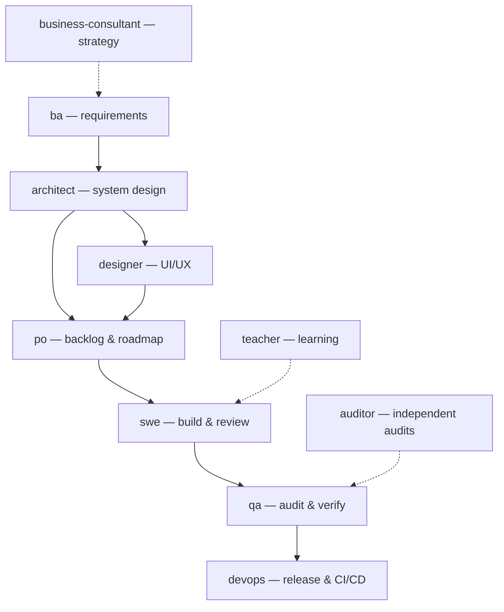

# Skills to Pay the AI Bills

A library of 10 self-contained **persona skills** — `SKILL.md` definitions an AI coding agent loads on demand to take on a role: business analyst, architect, engineer, QA, and more. Each persona embeds every workflow and shared contract it needs — no dependency trees, no plumbing skills.

Compatible with **opencode**, **Claude**, and any `.agents`-compatible runtime.

---

## Which persona do I load?

| Scenario | Load |
| :-- | :-- |
| Discover requirements; write or amend a PRD & FDS (greenfield or inherited system) | `ba` |
| System blueprint, data model, ADRs, coding standards, codebase docs, domain glossary | `architect` |
| UI/UX prototypes, versioned design system, accessibility audit & gate | `designer` |
| Turn requirements into a backlog: epics, stories, milestones, execution-order roadmap | `po` |
| Implement a feature, pick up the next planned item, debug, refactor, review, raise a PR | `swe` |
| Audit test coverage + security on a change; release-gate regression sweep; close coverage gaps | `qa` |
| Independent one-shot audits: security & governance, test coverage, blueprint drift | `auditor` |
| Cut a release, ship a hotfix, scaffold CI/CD, generate release notes | `devops` |
| Learn a language or technology; teach the agent a new skill | `teacher` |
| Business model canvas, value proposition, competitor analysis, go-to-market | `business-consultant` |

Just ask — the agent sees each installed persona's name + description and loads the right one. Every persona also documents its own slash commands in a `## Commands` table at the top of its file (e.g. `/swe pick up next item from plan`, `/qa release-gate`).

---

## Install

Each persona is a folder containing a `SKILL.md`. Copy or symlink the folders you want into one of the locations the agent searches:

| Scope | opencode | Claude | agents |
| :-- | :-- | :-- | :-- |
| Project | `.opencode/skills/<name>/` | `.claude/skills/<name>/` | `.agents/skills/<name>/` |
| Global | `~/.config/opencode/skills/<name>/` | `~/.claude/skills/<name>/` | `~/.agents/skills/<name>/` |

```sh
# Install everything globally for any agent
cp -R skills/* ~/.agents/skills/

# …or symlink a single persona (handy while iterating)
ln -s "$PWD/skills/swe" ~/.config/opencode/skills/swe
```

Rules that matter for discovery:

- Keep each folder name exactly as-is — it must equal the `name` in its frontmatter and match `^[a-z0-9]+(-[a-z0-9]+)*$`.
- Discovery is **flat** (`skills/*/SKILL.md`); do **not** nest folders or they won't be found.
- `SKILL.md` must be upper-case, and `name` must be unique across every install location.

---

## The persona chain at a glance

The delivery personas form an end-to-end pipeline; the rest are specialists you pull in as needed.


```mermaid
flowchart TD
    BC[business-consultant — strategy] -.-> BA[ba — requirements]
    BA --> ARCH[architect — system design]
    ARCH --> DES[designer — UI/UX]
    ARCH --> PO[po — backlog & roadmap]
    DES --> PO
    PO --> SWE[swe — build & review]
    SWE --> QA[qa — audit & verify]
    QA --> DO[devops — release & CI/CD]
    AUD[auditor — independent audits] -.-> QA
    T[teacher — learning] -.-> SWE
```

Personas hand off through artefacts in your repo (`docs/requirements/`, `docs/architecture/`, `docs/design/`, tracker work items) — never by spawning each other. When a persona needs work outside its role, it tells you which persona to load next.

---

## Conventions

- **Self-contained:** every persona embeds its workflow sections and shared contracts as demarcated blocks (`<!-- BEGIN SECTION|CONTRACT: name @ version (canonical: persona) -->`).
- **One canonical home per block:** all other embeddings are byte-identical copies. Edit the canonical home, bump its version, sync every copy (full rule in [`AGENTS.md`](AGENTS.md)).
- **No Mermaid inside `SKILL.md`:** control flow lives in numbered phases plus a `## Commands` table. Mermaid is welcome in generated artefacts.
- **Target-repo rules:** to make an agent proactive about using these skills in your own project, copy [`AGENTS.example.md`](AGENTS.example.md) into that repo as `AGENTS.md`.

## License

MIT
