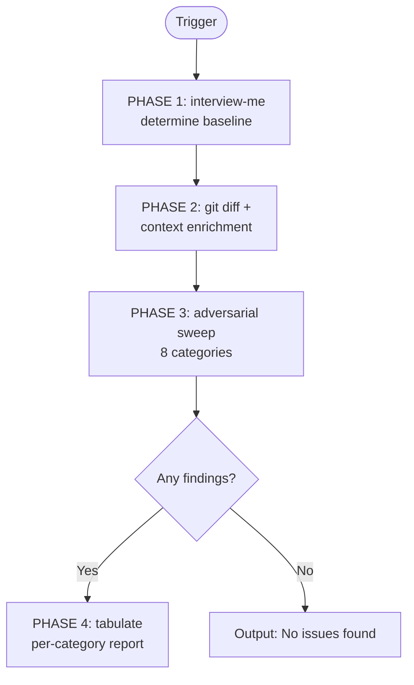

1. PHASE 1 (Scope): Determine baseline via `interview-me`.
   - Present default: all changes since last push (`HEAD..@{push}`).
   - Options: custom SHA/range, specific files/directories.
   - On `move-next`, proceed with selected scope.
   - `@{push}` fails → fallback to `HEAD~1..HEAD` with notice.

2. PHASE 2 (Diff & Context): Extract diff, file list, and changed Modules.
   - Attempt `resolve-repository-platform` to enrich with linked Issues/PRs.
   - Attempt `docs/requirements/functional-requirements.md` and `docs/architecture/system-blueprint.md` for contract cross-reference. Absent → note "no contract baseline" per category; never skip category.
   - Attempt style guide config files (`.editorconfig`, `.prettierrc*`, `eslint*`, `tsconfig*`, `rustfmt.toml`, `go.*` lint configs, `.clang-format`).

3. PHASE 3 (Adversarial Sweep): Review every changed file across all categories starting from guilty assumption. Per category:

   a. **Code quality**: DRY/KISS/SOLID violations, dead code, excessive complexity/Depth, error handling gaps (swallowed errors, bare `except:`, unwrapped optionals), concurrency bugs, magic numbers, oversized functions/Modules, unclear naming. Tag `[Risk: Level]` + `[Confidence: Level]`.
   b. **Architectural alignment**: Dependency-rule breaches (inward-pointing violations), Leaky Interfaces, bypassed Seams, wrong-layer placement, untracked Modules, `[Auth: Scope]` drift. Speak `design-vocab`.
   c. **Test coverage**: Missing tests for new/changed logic, untested branches, untested error paths, test-framework mismatch (flag via `detect-test-harness` if installed). Do not require 100% — flag untested risk-bearing paths.
   d. **Security**: Injection surfaces (XSS, SQLi, command injection), auth/authz bypass, hardcoded secrets, unsafe deserialisation, path traversal, missing input validation, TLS/crypto misuse. Anchor to OWASP Top 10 + CWE where applicable.
   e. **Governance / GDPR**: PII introduced or leaked, missing consent/erasure/retention controls, data flows crossing Seams to third parties without lawful basis, audit-logging gaps.
   f. **Requirements alignment**: Where original Issues/PRD/FDS references exist, flag implementation drift. Derive from linked Issues in commit messages or `resolve-repository-platform`.
   g. **Style guide alignment**: Flag violations against discovered style configs. Frontend: lint rules, import ordering, naming conventions, component structure. Backend: project-specific conventions. Absent config → note "no style baseline".
   h. **Dependency health**: New or bumped dependencies — check EOL status, deprecated APIs, known CVEs, license compatibility, copyleft exposure.

4. PHASE 4 (Report): Produce findings. Omit empty categories.

Directives:
- Calibration: `[Confidence: Confirmed]` = directly observed violation; `Probable` = strong indicator; `Possible` = borderline/requires verification. Borderline patterns get `Possible` — do not escalate severity beyond evidence supports. Never assert without empirical code evidence.
- Staging-gate purpose: pre-PR sanity check. Focus on what would block or degrade a human review. Skip trivial or subjective issues.
- Zero-findings: output `### Adversarial Review — No issues found` and stop.
- Strict `design-vocab` for architectural findings. Prohibited: component, service, unit, API, boundary.
- Strict `agent-markup` tokens: `[Risk: Level]`, `[Confidence: Level]`, `[Remediation: Effort]`.

Output Schema:

### Adversarial Review — `[Scope: <baseline>]` (`[Confidence: Level]`)

#### Code Quality Findings
| File | Finding | Risk (`[Risk: Level]`) | Confidence (`[Confidence: Level]`) |
| :--- | :--- | :--- | :--- |

#### Architectural Drift
| File | Drift Type (design-vocab) | Risk (`[Risk: Level]`) | Confidence (`[Confidence: Level]`) |
| :--- | :--- | :--- | :--- |

#### Test Coverage Gaps
| File | Gap | Risk (`[Risk: Level]`) | Confidence (`[Confidence: Level]`) |
| :--- | :--- | :--- | :--- |

#### Security Vulnerabilities
| File | Finding | OWASP / CWE | Risk (`[Risk: Level]`) | Confidence (`[Confidence: Level]`) | Remediation (`[Remediation: Effort]`) |
| :--- | :--- | :--- | :--- | :--- | :--- |

#### Governance & GDPR Exposure
| File | Finding | Data (`[Data: Classification]`) | Risk (`[Risk: Level]`) | Confidence (`[Confidence: Level]`) |
| :--- | :--- | :--- | :--- | :--- |

#### Requirements Drift
| File | Expected | Actual | Risk (`[Risk: Level]`) | Confidence (`[Confidence: Level]`) |
| :--- | :--- | :--- | :--- | :--- |

#### Style Guide Violations
| File | Rule | Source | Risk (`[Risk: Level]`) | Confidence (`[Confidence: Level]`) |
| :--- | :--- | :--- | :--- | :--- |

#### Dependency Concerns
| Dependency | Issue | Risk (`[Risk: Level]`) | Confidence (`[Confidence: Level]`) |
| :--- | :--- | :--- | :--- |