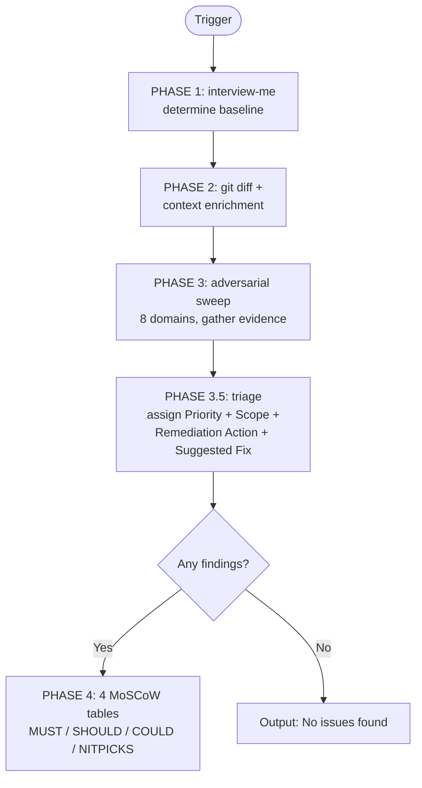

1. PHASE 1 (Scope): Determine baseline via `interview-me`.
   - Present default: all changes since last push (`HEAD..@{push}`).
   - Options: custom SHA/range, specific files/directories.
   - On `move-next`, proceed with selected scope.
   - `@{push}` fails → fallback to `HEAD~1..HEAD` with notice.

2. PHASE 2 (Diff & Context): Extract diff, file list, and changed Modules.
   - Attempt `resolve-repository-platform` to enrich with linked Issues/PRs.
   - Attempt `docs/requirements/functional-requirements.md` and `docs/architecture/system-blueprint.md` for contract cross-reference. Absent → note "no contract baseline" per category; never skip category.
   - Attempt style guide config files (`.editorconfig`, `.prettierrc*`, `eslint*`, `tsconfig*`, `rustfmt.toml`, `go.*` lint configs, `.clang-format`).

3. PHASE 3 (Adversarial Sweep): Review every changed file across all domains starting from guilty assumption. Per domain, identify findings and gather evidence (File:Line, Finding, Domain, `[Confidence: Level]`). Do NOT assign Priority or Remediation at this stage — triage happens in PHASE 3.5 with the full finding set visible.

   a. **Code Quality**: DRY/KISS/SOLID violations, dead code, excessive complexity/Depth, error handling gaps (swallowed errors, bare `except:`, unwrapped optionals), concurrency bugs, magic numbers, oversized functions/Modules, unclear naming.
   b. **Architectural Alignment**: Dependency-rule breaches (inward-pointing violations), Leaky Interfaces, bypassed Seams, wrong-layer placement, untracked Modules, `[Auth: Scope]` drift. Speak `design-vocab`.
   c. **Test Coverage**: Missing tests for new/changed logic, untested branches, untested error paths, test-framework mismatch (flag via `detect-test-harness` if installed). Do not require 100% — flag untested risk-bearing paths.
   d. **Security**: Injection surfaces (XSS, SQLi, command injection), auth/authz bypass, hardcoded secrets, unsafe deserialisation, path traversal, missing input validation, TLS/crypto misuse. Anchor to OWASP Top 10 + CWE inline in the Finding text — e.g. `SQL injection via string concatenation [CWE-89]`.
   e. **Governance & GDPR**: PII introduced or leaked, missing consent/erasure/retention controls, data flows crossing Seams to third parties without lawful basis, audit-logging gaps. Fold `[Data: Classification]` into the Finding text — e.g. `PII (email) logged without consent [Data: Special-Category]`.
   f. **Requirements Alignment**: Where original Issues/PRD/FDS references exist, flag implementation drift. Derive from linked Issues in commit messages or `resolve-repository-platform`.
   g. **Style Guide Alignment**: Flag violations against discovered style configs. Frontend: lint rules, import ordering, naming conventions. Backend: project-specific conventions. Absent config → note "no style baseline".
   h. **Dependency Health**: New or bumped dependencies — check EOL status, deprecated APIs, known CVEs, license compatibility, copyleft exposure.

4. PHASE 3.5 (Triage): With the full finding set visible, assign per finding:
   - **Priority** `[Review: Priority]`: Must (merge-blocking — breaks functionality, introduces vulnerability/violation, or regresses behaviour), Should (non-conformance with repo-resident standards: AGENTS.md, ADRs, blueprint, style configs, `docs/requirements/`), Could (opportunistic — adjacent code within one-hop blast radius of changed Seams/Interfaces that could benefit from updates, further tests, or refactor), Nitpick (typos, inconsistency, trivial non-conformance).
   - **Scope** `[Scope: Origin]`: Pre-existing (surfaced but not caused by the diff) vs Introduced (created by the diff). Drives fix-in-PR vs park-behind-bug-report.
   - **Remediation Action** `[Remediation: Action]`: Fix (MUST — resolve & re-review before proceeding), Accept (SHOULD — explicitly waive with recorded justification; silent ignore fails review), Defer (park behind a tracked work item), Log (COULD — capture for opportunistic action), None.
   - **Suggested Fix**: One actionable line — concrete starting point, not a full solution.
   Calibrate bands against each other — a finding is Must only if it would cause harm on merge. Consistency across the full set is the point of separating sweep from triage.

5. PHASE 4 (Report): Render 4 MoSCoW sections. Omit empty bands. One table per band, one row per finding.

   Row shape (all bands): `| File:Line | Finding | Suggested Fix | Domain | Priority | Scope | Confidence | Remediation Action |`

   Precedence: results must be actionable if the user chooses to act on them. Every row is extraction-grade — a downstream agent can lift it directly into an issue register without re-authoring. Tables are the single source of truth (no duplicate machine-readable block).

```mermaid
flowchart TD
    TRIGGER(["Trigger"]) --> PH1["PHASE 1: interview-me<br>determine baseline"]
    PH1 --> PH2["PHASE 2: git diff +<br>context enrichment"]
    PH2 --> PH3["PHASE 3: adversarial sweep<br>8 domains, gather evidence"]
    PH3 --> PH35["PHASE 3.5: triage<br>assign Priority + Scope +<br>Remediation Action + Suggested Fix"]
    PH35 --> FOUND{Any findings?}
    FOUND -->|Yes| REPORT["PHASE 4: 4 MoSCoW tables<br>MUST / SHOULD / COULD / NITPICKS"]
    FOUND -->|No| CLEAR["Output: No issues found"]
```

Directives:
- Calibration: `[Confidence: Confirmed]` = directly observed violation; `Probable` = strong indicator; `Possible` = heuristic needing verification — phrase as "requires verification", never assert. Never assert without empirical code evidence.
- Staging-gate purpose: pre-PR sanity check. Focus on what would block or degrade a human review.
- Zero-findings: output `### Adversarial Review — No issues found` and stop.
- No suppression: capture and surface all findings, including nitpicks. The standards you walk past are the standards you accept.
- Strict `design-vocab` for architectural findings. Prohibited: component, service, unit, API, boundary.
- Strict `agent-markup` tokens: `[Review: Priority]`, `[Scope: Origin]`, `[Confidence: Level]`, `[Remediation: Action]`, `[Data: Classification]` (inline in Finding text for Governance).

Output Schema:

### Adversarial Review — `[Baseline: <range>]`

#### Must Fix
| File:Line | Finding | Suggested Fix | Domain | Priority | Scope | Confidence | Remediation Action |
| :--- | :--- | :--- | :--- | :--- | :--- | :--- | :--- |

#### Should Fix
| File:Line | Finding | Suggested Fix | Domain | Priority | Scope | Confidence | Remediation Action |
| :--- | :--- | :--- | :--- | :--- | :--- | :--- | :--- |

#### Could Fix
| File:Line | Finding | Suggested Fix | Domain | Priority | Scope | Confidence | Remediation Action |
| :--- | :--- | :--- | :--- | :--- | :--- | :--- | :--- |

#### Nitpicks
| File:Line | Finding | Suggested Fix | Domain | Priority | Scope | Confidence | Remediation Action |
| :--- | :--- | :--- | :--- | :--- | :--- | :--- | :--- |
