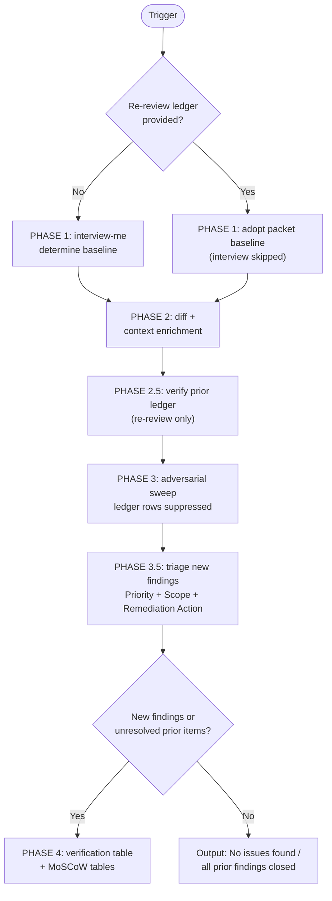

**Accepts:** `[Handoff: Clean]` from `swe` PHASE 3 — `[Review: Round 1]` initial or `[Review: Round N]` re-review.
Accepted (round 1): review scope, persona directive, reference links (tracked issues / requirement artefacts).
Accepted (re-review, per the `agent-handoff` re-review profile): prior review ledger, review scope (baseline from round N-1), persona directive, reference links (tracked issues / requirement artefacts).
Ledger absent → initial review (round 1); packet baseline absent → `HEAD..@{push}` default.

1. PHASE 1 (Scope): Determine baseline.
   - Round 1 (no ledger): via `interview-me`. Present default: all changes since last push (`HEAD..@{push}`). Options: custom SHA/range, specific files/directories. On `move-next`, proceed with selected scope. `@{push}` fails → fallback to `HEAD~1..HEAD` with notice.
   - Re-review (ledger present): adopt the packet baseline; interview skipped.

2. PHASE 2 (Diff & Context): Extract diff, file list, and changed Modules.
   - Attempt `resolve-repository-platform` to enrich with linked Issues/PRs.
   - Attempt `docs/requirements/functional-requirements.md` and `docs/architecture/system-blueprint.md` for contract cross-reference. Absent → note "no contract baseline" per category; never skip category.
   - Attempt style guide config files (`.editorconfig`, `.prettierrc*`, `eslint*`, `tsconfig*`, `rustfmt.toml`, `go.*` lint configs, `.clang-format`).
   - Attempt `docs/architecture/coding-standards.md` (rules + waiver register). Present → primary style baseline: verify Tier 1 rules by executing the referenced formatter/linter config, review Tier 2 rules adversarially against the rubric's do/don't exemplars, silence violations matching a waiver's scope. Absent → note "no coding-standards baseline" and fall back to discovered style configs only.

3. PHASE 2.5 (Ledger Verification — re-review only; skipped otherwise): Verify each ledger row independently against the current tree. Never trust the claimed resolution — re-observe the code.
   - Action `[Remediation: Fix]` → resolution demonstrated with evidence → `[Review: Verified]`; still present or incomplete → `[Review: Unresolved]` (retains its original Finding ID and `[Review: Priority]`).
   - Action other than Fix → `[Review: Recorded]`; never re-flagged.
   - Evidence = the observation proving the outcome, not the claim; cannot prove resolved → Unresolved.

4. PHASE 3 (Adversarial Sweep): Review the full baseline across all domains starting from guilty assumption. Per domain, identify findings and gather evidence (File:Line, Finding, Domain, `[Confidence: Level]`). Do NOT assign Priority or Remediation at this stage — triage happens in PHASE 3.5 with the full finding set visible.
   - Finding IDs: `RV-###` zero-padded. Round 1 assigns from `RV-001` in report order (Must → Should → Could → Nitpick); re-review continues from the ledger's highest ID. IDs are stable — never renumber or reuse.
   - Ledger suppression: a swept finding matching a ledger row is never re-reported; ledger rows appear only in the verification table.

   a. **Code Quality**: DRY/KISS/SOLID violations, dead code, excessive complexity/Depth, error handling gaps (swallowed errors, bare `except:`, unwrapped optionals), concurrency bugs, magic numbers, oversized functions/Modules, unclear naming.
   b. **Architectural Alignment**: Dependency-rule breaches (inward-pointing violations), Leaky Interfaces, bypassed Seams, wrong-layer placement, untracked Modules, `[Auth: Scope]` drift. Speak `design-vocab`.
   c. **Test Coverage**: Missing tests for new/changed logic, untested branches, untested error paths, test-framework mismatch (flag via `detect-test-harness` if installed). Do not require 100% — flag untested risk-bearing paths.
   d. **Security**: Injection surfaces (XSS, SQLi, command injection), auth/authz bypass, hardcoded secrets, unsafe deserialisation, path traversal, missing input validation, TLS/crypto misuse. Anchor to OWASP Top 10 + CWE inline in the Finding text — e.g. `SQL injection via string concatenation [CWE-89]`.
   e. **Governance & GDPR**: PII introduced or leaked, missing consent/erasure/retention controls, data flows crossing Seams to third parties without lawful basis, audit-logging gaps. Fold `[Data: Classification]` into the Finding text — e.g. `PII (email) logged without consent [Data: Special-Category]`.
   f. **Requirements Alignment**: Where original Issues/PRD/FDS references exist, flag implementation drift. Derive from linked Issues in commit messages or `resolve-repository-platform`.
   g. **Style Guide Alignment**: Flag violations against `docs/architecture/coding-standards.md` when present — Tier 1 failures from executing its config, Tier 2 violations of its rubric, each finding citing the breached `RULE-###`. Otherwise flag violations against discovered style configs. Frontend: lint rules, import ordering, naming conventions. Backend: project-specific conventions. Absent both → note "no style baseline". Violations matching a `WAIVER-###` scope are silenced, never reported.
   h. **Dependency Health**: New or bumped dependencies — check EOL status, deprecated APIs, known CVEs, license compatibility, copyleft exposure.

5. PHASE 3.5 (Triage): With the full finding set visible, assign per new finding:
   - **Priority** `[Review: Priority]`: Must (merge-blocking — breaks functionality, introduces vulnerability/violation, or regresses behaviour), Should (non-conformance with repo-resident standards: AGENTS.md, ADRs, blueprint, style configs, `docs/requirements/`), Could (opportunistic — adjacent code within one-hop blast radius of changed Seams/Interfaces that could benefit from updates, further tests, or refactor), Nitpick (typos, inconsistency, trivial non-conformance).
   - **Scope** `[Scope: Origin]`: Pre-existing (surfaced but not caused by the diff) vs Introduced (created by the diff). Drives fix-in-PR vs park-behind-bug-report.
   - **Remediation Action** `[Remediation: Action]`: Fix (MUST — resolve & re-review before proceeding), Accept (SHOULD — explicitly waive with recorded justification; silent ignore fails review), Defer (park behind a tracked work item), Log (COULD — capture for opportunistic action), None.
   - **Suggested Fix**: One actionable line — concrete starting point, not a full solution.
   Calibrate bands against each other — a finding is Must only if it would cause harm on merge. Consistency across the full set is the point of separating sweep from triage.

6. PHASE 4 (Report):
   - Round 1: render 4 MoSCoW sections. Omit empty bands. One table per band, one row per finding.
   - Re-review: always render the Prior Findings Verification table (one row per ledger finding), then 4 MoSCoW sections for new findings only. Omit empty bands. No new findings and no Unresolved row → append `All prior findings closed; no new findings.`

   Row shape (all bands): `| Finding ID | File:Line | Finding | Suggested Fix | Domain | Priority | Scope | Confidence | Remediation Action |`
   Verification row shape: `| Finding ID | File:Line | Priority | Verification | Evidence |`

   Precedence: results must be actionable if the user chooses to act on them. Every row is extraction-grade — a downstream agent can lift it directly into an issue register without re-authoring. Tables are the single source of truth (no duplicate machine-readable block).

```mermaid
flowchart TD
    TRIGGER(["Trigger"]) --> MODE{Re-review ledger<br>provided?}
    MODE -->|No| PH1["PHASE 1: interview-me<br>determine baseline"]
    MODE -->|Yes| PH1R["PHASE 1: adopt packet baseline<br>(interview skipped)"]
    PH1 --> PH2["PHASE 2: diff +<br>context enrichment"]
    PH1R --> PH2
    PH2 --> PH25["PHASE 2.5: verify prior ledger<br>(re-review only)"]
    PH25 --> PH3["PHASE 3: adversarial sweep<br>ledger rows suppressed"]
    PH3 --> PH35["PHASE 3.5: triage new findings<br>Priority + Scope + Remediation Action"]
    PH35 --> OPEN{New findings or<br>unresolved prior items?}
    OPEN -->|Yes| REPORT["PHASE 4: verification table<br>+ MoSCoW tables"]
    OPEN -->|No| CLEAR["Output: No issues found /<br>all prior findings closed"]
```

Directives:
- Calibration: `[Confidence: Confirmed]` = directly observed violation; `Probable` = strong indicator; `Possible` = heuristic needing verification — phrase as "requires verification", never assert. Never assert without empirical code evidence.
- Staging-gate purpose: pre-PR sanity check. Focus on what would block or degrade a human review.
- Zero-findings (round 1): output `### Adversarial Review — [Review: Round 1] — No issues found` and stop.
- No suppression during a sweep: capture and surface all findings, including nitpicks. The standards you walk past are the standards you accept. Ledger rows are accounted in the verification table, not swept.
- Round header: `### Adversarial Review — [Review: Round N] — [Baseline: <range>]`. Round N comes from the packet; absent packet → Round 1.
- Ledger integrity: every finding from every prior round appears exactly once in the ledger; never omit. Unresolved prior findings retain original IDs and priorities.
- Strict `design-vocab` for architectural findings. Prohibited: component, service, unit, API, boundary.
- Strict `agent-markup` tokens: `[Review: Round]`, `[Review: Priority]`, `[Review: Verification]`, `[Scope: Origin]`, `[Confidence: Level]`, `[Remediation: Action]`, `[Data: Classification]` (inline in Finding text for Governance).
- Coding-standards gate: when `docs/architecture/coding-standards.md` is present it is the authoritative style baseline — Tier 1 verified by executing its config, Tier 2 reviewed against its rubric, findings cite `RULE-###`. Waived violations (`WAIVER-###` scope match) are silenced. Priority follows each rule's recorded `[Review: Priority]` severity.

Output Schema:

### Adversarial Review — `[Review: Round N]` — `[Baseline: <range>]`

*(Re-review only:)*

#### Prior Findings Verification
| Finding ID | File:Line | Priority | Verification | Evidence |
| :--- | :--- | :--- | :--- | :--- |

#### Must Fix
| Finding ID | File:Line | Finding | Suggested Fix | Domain | Priority | Scope | Confidence | Remediation Action |
| :--- | :--- | :--- | :--- | :--- | :--- | :--- | :--- | :--- |

#### Should Fix
| Finding ID | File:Line | Finding | Suggested Fix | Domain | Priority | Scope | Confidence | Remediation Action |
| :--- | :--- | :--- | :--- | :--- | :--- | :--- | :--- | :--- |

#### Could Fix
| Finding ID | File:Line | Finding | Suggested Fix | Domain | Priority | Scope | Confidence | Remediation Action |
| :--- | :--- | :--- | :--- | :--- | :--- | :--- | :--- | :--- |

#### Nitpicks
| Finding ID | File:Line | Finding | Suggested Fix | Domain | Priority | Scope | Confidence | Remediation Action |
| :--- | :--- | :--- | :--- | :--- | :--- | :--- | :--- | :--- |
