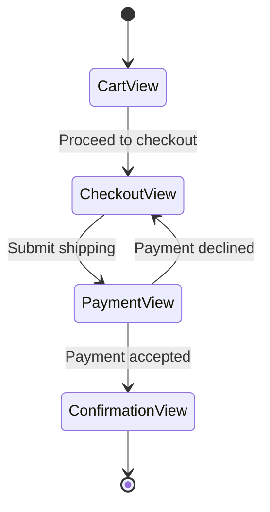
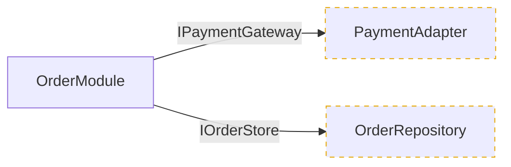
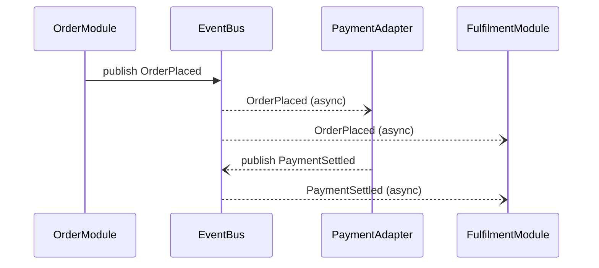

1. PHASE 1 (Contract Gate): Check `docs/requirements/functional-requirements.md`.
   - Missing/empty → hand off to `gather-requirements` to generate FDS.
   - ELSE: proceed, using FDS as behavioral baseline.
2. PHASE 2 (Ingestion & Delta): Map physical repo structures, boundaries, dependencies. Extract library/framework/language versions from manifests (package.json, .csproj, go.mod, Gemfile, Prisma schemas). Independently evaluate vendor support timelines and EOL status against current calendar year.
3. PHASE 3 (Incremental Checkpoints): Output blueprint ONE section at a time per Rationalized Schema Structure. Before first section, announce checkpoint protocol: pause after each section; user must issue literal `move-next` to advance. Answering questions is NOT advancement. Re-render as needed until `move-next`.

Directives:
- Checkpoint Advancement: ONLY literal `move-next` authorises advancing. State at Phase 3 start. If in doubt, stay.
- Output Location: final consolidated blueprint → `docs/architecture/system-blueprint.md`.
- Strict `design-vocab`: Module, Interface, Implementation, Depth, Seam, Adapter. Prohibited: component, service, unit, API, signature, boundary.
- Strict `agent-markup` enumerations.
- No Narrative Fluff.
- Security/Governance Scope: incidental security flaw → capture in "Out-of-Scope Findings Flagged" callout at end of Section 5, recommend `audit-security-and-governance`. Never force into blueprint sections.
- Table-First: use Markdown tables.
- Mermaid.js exclusively for diagrams. Every diagram MUST be valid Mermaid.js markdown. One diagram topic per diagram — never conflate multiple topics onto a single diagram (e.g. no mixing class diagram with dependency diagram, flowchart with state diagram, etc.). Each sub-section (2.2, 2.3.1, 2.3.2, 2.3.4) MUST be a SEPARATE diagram.

Schema & Checkpoint Sequence:

### SECTION 1: System Overview & Governance Profile
#### 1.1 Core Intent & Persona Registry
| Persona / Role | System Owner / Contact | `[Auth: Scope]` | SLA / Support Tier |

### SECTION 2: Structural Architecture & Code Mapping
#### 2.1 Technology Stack & Platform Targets

#### 2.2 Module Interdependency & Risk Surface Map
Goal: Reveal how Modules depend on one another and where coupling creates fragility — NOT mirror folder tree.
- Interdependency Graph (Mermaid `flowchart`): directed graph, nodes = Modules, edges = real import/invocation dependencies. Group by architectural Depth/layer with `subgraph`. Label edges crossing Seams with Interface/Adapter.
  Reference shape:
  ```mermaid
  flowchart TD
    subgraph Presentation
      CheckoutView
    end
    subgraph Domain
      OrderModule
      PricingModule
    end
    subgraph Infrastructure
      PaymentAdapter
      OrderRepository
    end
    CheckoutView --> OrderModule
    OrderModule --> PricingModule
    OrderModule -->|IPaymentGateway| PaymentAdapter
    OrderModule --> OrderRepository
    PricingModule -.->|cyclic| OrderModule
  ```
  PROHIBITED: file/folder trees, class diagrams, member fields, method signatures. If cannot be expressed as Module-level dependency → does not belong.
- Risk Surface Registry:
  | Surface / Hotspot | Module(s) Involved | Design Concern (cyclic, god-module, leaky Seam, shallow Impl) | Blast Radius | Risk (`[Risk: Level]`) |
  | :--- | :--- | :--- | :--- | :--- |

#### 2.3 Application Flow & Seam Test Topology
Each sub-section MUST be a SEPARATE diagram. Never merge topics, themes, or diagram types (e.g. no mixing class diagram with dependency diagram, flowchart with state diagram).

##### 2.3.1 View Transition / User Flow (Mermaid `stateDiagram-v2`)
One diagram per distinct primary flow (onboarding, checkout, admin). States = Views, edges = user action/trigger.
Reference shape:


##### 2.3.2 Seam Topology & Test Placement (Mermaid `flowchart`)
Map every Seam where Module crosses into Adapter/Interface. Mark where seam-level tests + mock/fake Adapters injected.
Reference shape:


##### 2.3.3 Module Shallowness Resolution
| Shallow Module | Symptom (thin Impl / pass-through / leaky Interface) | Recommended Resolution | Risk if Unresolved (`[Risk: Level]`) |
| :--- | :--- | :--- | :--- |

##### 2.3.4 Execution Lifecycle (CONDITIONAL — Mermaid `sequenceDiagram`)
Trigger: ONLY for async, event-driven/pub-sub, concurrent, saga/orchestrated, multi-service flows where temporal ordering exposes risk not visible in 2.2. For sync request-response, OMIT and state why.
Reference shape:


### SECTION 3: Lifecycle & Ecosystem Matrix
#### 3.1 Automated Tech Stack Lifecycle & EOL Registry
(Evaluated independently against industry horizons for current calendar year)
| Module / Library | Discovered Version | Target Platform | Industry Support Status | Upgrade Risk (`[Risk: Level]`) |
| :--- | :--- | :--- | :--- | :--- |

#### 3.2 Solution Ecosystem & Companion Dependencies Map
| System / Companion App | Seam / Relationship | Integration Vector | Shared Assets / State |

### SECTION 4: DevOps & Operational Governance
#### 4.1 Development Workflow & Delivery Pipeline Matrix
| Phase | Tooling / Platform | Workflow Rule (`[Policy]`) | Verification Gates |

#### 4.2 Knowledge & Incident Infrastructure
| Resource Type | Location / Target | Update Policy | SLA Breach Protocol |

### SECTION 5: Data Layer & Security Schemas
#### 5.1 Data Dictionary & Schema Definitions
Tag every entity/field with `[Data: Classification]`. `Special-Category` (GDPR Art. 9) = highest priority.
| Entity / Field | Type / Constraints | Store / Module | Sensitivity (`[Data: Classification]`) |
| :--- | :--- | :--- | :--- |

#### 5.2 Multi-Tenancy & Data Isolation Model
State isolation strategy + which `[Data: Classification]` tiers each rule protects.

### SECTION 6: Test Surface Architecture Blueprint
#### 6.1 Target Test Surface Mapping
Map optimal verification surfaces based on module depth. Identify highest-leverage Interfaces + Seams where testing provides maximum capability per unit of test code, specifying where mock/fake Adapters injected.

### SECTION 7: Strategic Architectural Recommendation
#### 7.1 Discovered Architectural Pattern & Target Evolution
Identify dominant architectural style. Evaluate alignment with depth, leverage, locality, testability. If structural friction → recommend architectural pattern that benefits maintenance and lifecycle goals.