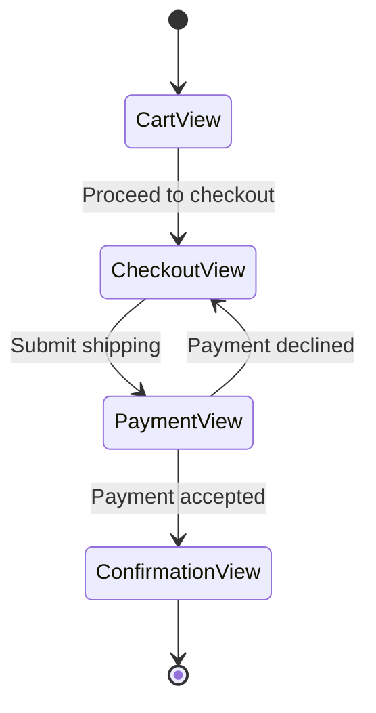
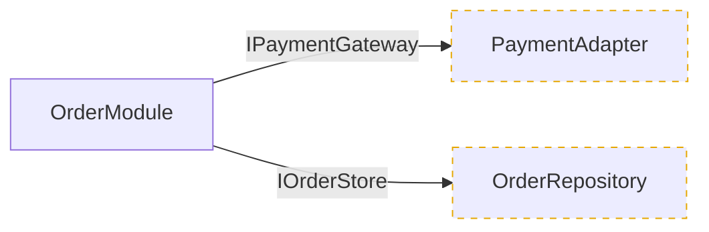
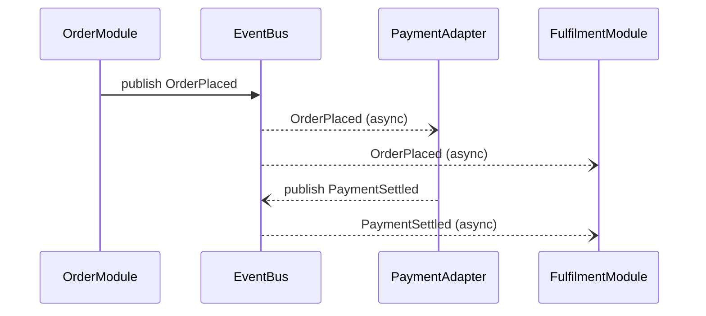

Operational Workflow:
1. PHASE 1 (Upfront Contract Verification & Guardrail Gate): Check for the existence of `docs/requirements/functional-requirements.md`.
     - IF the file does not exist or is empty: Hand off execution immediately to the `gather-requirements` skill to drive the technical interview and generate the FDS contract.
     - ELSE: Proceed directly to Phase 2, utilizing the FDS as the absolute behavioral baseline.
2. PHASE 2 (Ingestion & Delta Analysis): Map the physical repository structures, boundaries, and dependencies. Actively extract library, framework, and language versions from manifest files (e.g., package.json, .csproj, go.mod, Gemfile, Prisma schemas) and independently evaluate their official vendor support timelines and EOL (End of Life) statuses relative to the current calendar year.
3. PHASE 3 (Deterministic Output via Incremental Checkpoints): Output the final blueprint strictly matching the "Rationalized Schema Structure" below. You must deliver this blueprint ONE major section at a time. Before rendering the first section, announce the checkpoint protocol to the user: explain that you will pause after every section and that they must issue the explicit command `move-next` to advance, so they have unlimited time to ask follow-up questions. After rendering a section, PAUSE execution, explain your key findings/clarifications, and invite the user to ask questions or request corrections. You MUST remain on the current section — answering questions, applying corrections, and re-rendering as needed — until the user issues the literal `move-next` command. Answering a user question is NOT approval to advance; treat any message that is not the exact `move-next` command as further work on the current section.

## Operational Directives
- Checkpoint Advancement Contract: The ONLY trigger that authorizes moving from one section to the next is the user issuing the literal command `move-next`. State this convention explicitly at the start of Phase 3. Never auto-advance after answering a question or applying an edit; if in doubt, stay on the current section and wait for `move-next`.
- Output Location Contract: Upon final approval of all checkpoints, the entire consolidated blueprint must be written to or overwritten at exactly `docs/architecture/system-blueprint.md` relative to the repository root.
- Vocabulary Compliance: You must strictly adhere to the taxonomy defined in the `design-vocab` skill. All structural elements must be described using Module, Interface, Implementation, Depth, Seam, and Adapter. The terms component, service, unit, API, signature, and boundary are explicitly prohibited.
- Markup Compliance: You must strictly restrict values inside square bracket tokens to the enumerations allowed by the `agent-markup` skill.
- No Narrative Fluff: Keep text minimal, punchy, and highly structured.
- Security & Governance Scope Boundary: This blueprint maps architecture, not vulnerabilities. If analysis incidentally surfaces a security flaw or data-protection/GDPR exposure, do NOT force it into the blueprint sections. Instead, capture it tersely in a dedicated "Out-of-Scope Findings Flagged" callout at the end of Section 5 and explicitly recommend the user run the `audit-security-and-governance` skill for a proper, evidence-bound assessment. Never let a serious finding silently evaporate because it did not fit the schema.
- Table-First Design: Use Markdown tables for profiles, registries, dictionaries, and matrices.
- Visuals: Use valid Mermaid.js code blocks exclusively for all diagrams.

## Rationalized Schema Structure & Checkpoint Sequence

### SECTION 1 CHECKPOINT: System Overview & Governance Profile
#### 1.1 Core Intent & Persona Registry
| Persona / Role | System Owner / Contact | `[Auth: Scope]` | SLA / Support Tier |

---

### SECTION 2 CHECKPOINT: Structural Architecture & Code Mapping
#### 2.1 Technology Stack & Platform Targets
#### 2.2 Module Interdependency & Risk Surface Map
*(Goal: Reveal how Modules actually depend on one another and where that coupling creates fragility — NOT to mirror the folder tree.)*
- **Interdependency Graph (Mermaid `flowchart`):** Render a directed graph whose nodes are Modules and whose edges are real import/invocation dependencies (caller → callee). Group nodes by architectural Depth/layer using `subgraph`. Direct edges across Seams should be labelled with the Interface or Adapter they cross.
  *(Reference shape — match this style, not the contents):*
  ```mermaid
  flowchart TD
    subgraph Presentation
      CheckoutView
    end
    subgraph Domain
      OrderModule
      PricingModule
    end
    subgraph Infrastructure
      PaymentAdapter
      OrderRepository
    end
    CheckoutView --> OrderModule
    OrderModule --> PricingModule
    OrderModule -->|IPaymentGateway| PaymentAdapter
    OrderModule --> OrderRepository
    PricingModule -.->|cyclic| OrderModule
  ```
- **PROHIBITED:** Do not emit file/folder directory trees, class diagrams, member fields, or method signatures. If a node cannot be expressed as a Module-level dependency it does not belong in this graph.
- **Risk Surface Registry:** Following the graph, enumerate the highest-concern coupling surfaces discovered in the dependency structure.
  | Surface / Hotspot | Module(s) Involved | Design Concern (e.g. cyclic dependency, god-module, leaky Seam, shallow Implementation) | Blast Radius | Risk (`[Risk: Level]`) |
  | :--- | :--- | :--- | :--- | :--- |
#### 2.3 Application Flow & Seam Test Topology
*(MANDATE: The sub-sections below MUST be rendered as SEPARATE diagrams. Never merge these themes — or the module dependency graph from 2.2 — into a single combined diagram. Each theme below earns its own distinct diagram.)*

##### 2.3.1 View Transition / User Flow (one Mermaid `stateDiagram-v2` per primary flow)
*(Goal: Capture the explicit path a user walks through the application. Produce one diagram per distinct primary flow — e.g. onboarding, checkout, admin — where states are Views and edges are the user action/trigger that transitions between them. Do not include Module internals here.)*
*(Reference shape — match this style, not the contents):*


##### 2.3.2 Seam Topology & Test Placement (Mermaid `flowchart`)
*(Goal: Map every Seam where a Module crosses into an Adapter/Interface, and mark explicitly where seam-level unit tests and mock/fake Adapters must be injected. This is the structural input the consolidated registry in Section 6 builds on.)*
*(Reference shape — match this style, not the contents):*


##### 2.3.3 Module Shallowness Resolution
*(Goal: Where the dependency and seam structure exposes shallow Modules — thin Implementations hidden behind wide Interfaces, or pass-through Modules that add Depth without leverage — name them and recommend consolidation. Links to the depth evaluation in Section 7.)*
| Shallow Module | Symptom (thin Implementation / pass-through / leaky Interface) | Recommended Resolution | Risk if Unresolved (`[Risk: Level]`) |
| :--- | :--- | :--- | :--- |

##### 2.3.4 Execution Lifecycle (CONDITIONAL — Mermaid `sequenceDiagram`)
*(Trigger: Render this ONLY for flows that are asynchronous, event-driven/pub-sub, concurrent, saga/orchestrated, or span multiple services — i.e. where temporal ordering exposes a risk not already visible in 2.2. For conventional synchronous request-response flows, OMIT this entirely; do not redraw the dependency graph with time arrows. State explicitly when it is omitted and why.)*
*(Reference shape — match this style, not the contents):*


---

### SECTION 3 CHECKPOINT: Lifecycle & Ecosystem Matrix
#### 3.1 Automated Tech Stack Lifecycle & EOL Registry
*(Note: Evaluated independently by the agent against industry horizons for the current calendar year)*
| Module / Library | Discovered Version | Target Platform | Industry Support Status | Upgrade Risk (`[Risk: Level]`) |
| :--- | :--- | :--- | :--- | :--- |

#### 3.2 Solution Ecosystem & Companion Dependencies Map
| System / Companion App | Seam / Relationship | Integration Vector | Shared Assets / State |

---

### SECTION 4 CHECKPOINT: DevOps & Operational Governance
#### 4.1 Development Workflow & Delivery Pipeline Matrix
| Phase | Tooling / Platform | Workflow Rule (`[Policy]`) | Verification Gates |

#### 4.2 Knowledge & Incident Infrastructure
| Resource Type | Location / Target | Update Policy | SLA Breach Protocol |

---

### SECTION 5 CHECKPOINT: Data Layer & Security Schemas
#### 5.1 Data Dictionary & Schema Definitions
*(Tag every entity/field's sensitivity with `[Data: Classification]` so downstream audits can detect classification drift. Treat `Special-Category` (GDPR Art. 9) as the highest-priority tier.)*
| Entity / Field | Type / Constraints | Store / Module Location | Sensitivity (`[Data: Classification]`) |
| :--- | :--- | :--- | :--- |
#### 5.2 Multi-Tenancy & Data Isolation Model
*(State the isolation strategy and which `[Data: Classification]` tiers each isolation rule protects, so the security/governance audit can cross-reference intent against implementation.)*

---

### SECTION 6 CHECKPOINT: Test Surface Architecture Blueprint
#### 6.1 Target Test Surface Mapping
*(Note: Map the optimal surfaces for verification based on module depth. Identify the highest-leverage interfaces and seams where testing provides maximum capability per unit of test code, explicitly specifying where mock/fake adapters should be injected.)*

---

### SECTION 7 CHECKPOINT: Strategic Architectural Recommendation
#### 7.1 Discovered Architectural Pattern & Target Evolution
*(Note: Identify and name the dominant architectural style present in the codebase. Evaluate its alignment with the principles of depth, leverage, locality, and testability. If structural friction is discovered, provide an expert recommendation for an architectural pattern that would explicitly benefit the project's maintenance and lifecycle goals.)*
