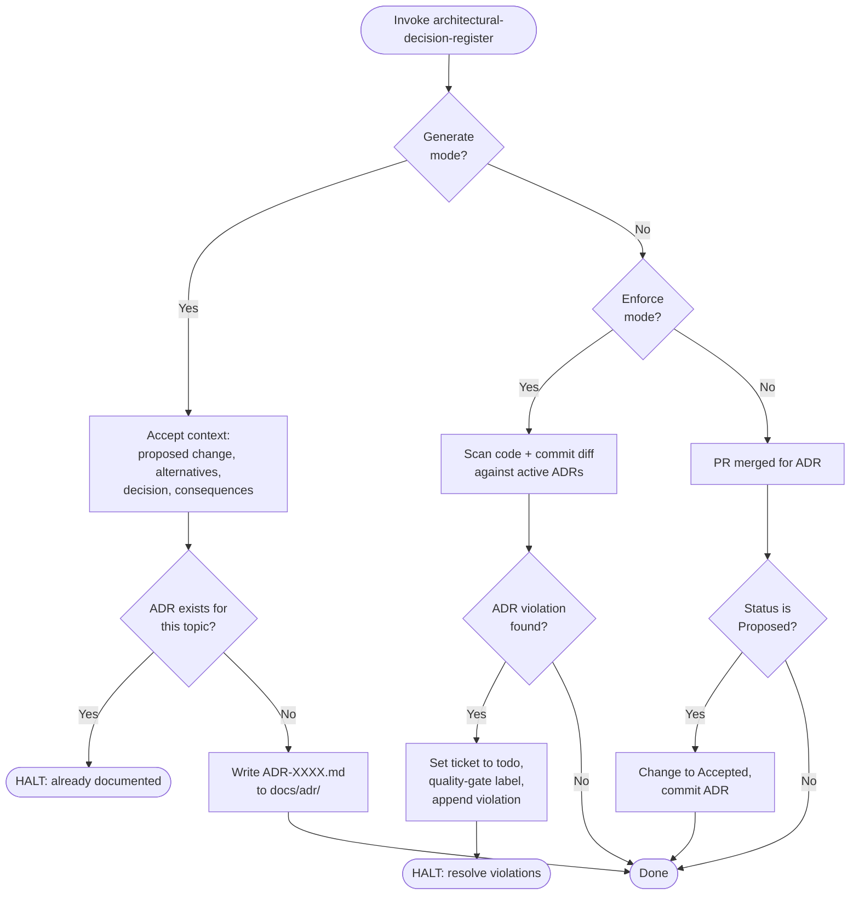

1. PHASE 1 (Generate): Accept context (proposed change, alternatives, selected decision, consequences). Check `docs/adr/` for existing ADR on same topic. Already exists → HALT. Missing → determine next number (highest ADR-XXXX + 1, zero-padded to 4 digits), write `docs/adr/ADR-XXXX.md` using template below.

2. PHASE 2 (Enforce): Scan codebase + commit diff against active ADRs (Status: Proposed or Accepted). Report every violation: location, ADR reference, violated constraint, corrective action. Violations found → set ticket to `todo`, apply `quality-gate` label, append violation details, HALT.

3. PHASE 3 (Finalize): On PR merge for an ADR, check status. `Proposed` → change to `Accepted`, commit `docs/adr/ADR-XXXX.md`. Otherwise → no-op.

Directives:
- Template:
  ```markdown
  # ADR [000X]: [Title]

  ## Status

  [Proposed | Accepted | Deprecated | Superseded by ADR-XXXX]

  ## Context

  [Explanation of the problem, constraints, and options considered]

  ## Decision

  [The definitive technical or architectural choice made]

  ## Consequences

  - **Positive:** [Benefits of this approach]
  - **Negative:** [Trade-offs, tech debt, or limitations]
  - **Implementation Notes:** [Specific constraints, e.g., pnpm worktree rules, directory structures, or strict typing requirements]
  ```
- Output Directory: `docs/adr/`.
- File Format: `.md` (Markdown).
- Strict `agent-markup` enumerations.
- Use `design-vocab` taxonomy for architecture terms within ADR content.
- Never overwrite existing ADRs.
- Numbering: find highest existing ADR-XXXX number, increment by 1, zero-pad to 4 digits.