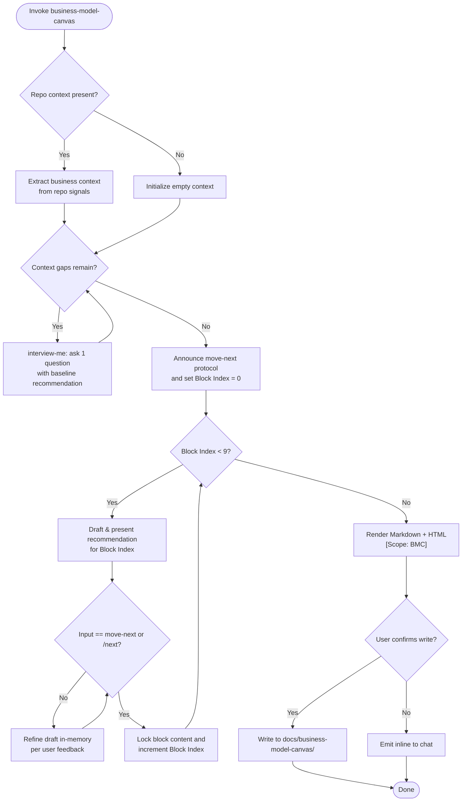

Collect exactly the 9 BMC segments in order. All 9 segments MUST exist in the output in fixed order to guarantee consistent schema and visual structure. NEVER fabricate facts — unresolved segments stay empty.



1. PHASE 0 (Context Discovery & Gap Interview):
   - Inspect repo manifests, README, docs, and requirements to pre-populate domain and business context.
   - For missing foundational context: drive `interview-me` asking ONE question at a time, each with a calculated baseline recommendation, until shared understanding is reached.
   - Announce the advancement protocol: answering questions or refining is NOT advancement. Only literal `move-next` or `/next` locks a section and advances.

2. PHASE 1 (Recommendation-Led Section Walkthrough):
   - Walk through the 9 BMC blocks in fixed order.
   - For each block: present a synthesized, calculated recommendation draft as the baseline.
   - User may critique, question, or request alterations. Refine the draft in-memory. Answering or discussing does NOT advance.
   - Advance to the next block ONLY when the user issues `move-next` or `/next`.
   - Support interactive commands:
     - `move-next` / `/next` — lock current block content and advance to next block
     - `/back` — return to previous block
     - `/edit <block>` — jump to a named block
     - `/done` — finish elicitation early and advance to Render
     - `/status` — display filled and remaining blocks

   Block sequence and definitions:
   1. **Customer Segments** — Target users and organizations the business creates value for.
   2. **Value Propositions** — Core value, utility, and problem-solving offered to each segment.
   3. **Channels** — Touchpoints and routes used to deliver value (direct, web, partner).
   4. **Customer Relationships** — Engagement types established per segment (automated, personal, self-serve).
   5. **Revenue Streams** — Monetization models, pricing mechanisms, and willingness-to-pay sources.
   6. **Key Resources** — Critical physical, intellectual, human, and financial assets required.
   7. **Key Activities** — Essential operations and production steps needed to execute the model.
   8. **Key Partnerships** — External alliances, suppliers, and collaborators that sustain operations.
   9. **Cost Structure** — Most significant operational and capital cost drivers.

3. PHASE 2 (Render): Compile completed canvas into two formats:
   - **Markdown** — structured document, each block as a heading with its content. All 9 headings MUST be present.
   - **HTML** — self-contained page with inline styles rendering the BMC 9-cell grid layout. All 9 cells MUST be rendered. Tag `[Scope: BMC]`.

4. PHASE 3 (Output): Present outputs. Offer to write to `docs/business-model-canvas/`. Do not write without explicit confirmation. Fallback: inline display.

Directives:
- Complete 9-Segment Coverage: Every output canvas MUST contain all 9 segments in fixed order to ensure consistent layout. Unanswered blocks render as "(not defined)".
- One Block Per Interaction: Present exactly one block recommendation per turn.
- Recommendation-First: Every section begins with the agent's drafted recommendation baseline based on discovered context.
- Strict Advancement: Advancing requires literal `move-next` or `/next`. Never auto-advance on conversational feedback.
- Anti-Fabrication: Unanswered/skipped blocks store empty string and render as "(not defined)".
- Output Portability: HTML self-contained with inline styles. Markdown valid CommonMark.

Schema `[Scope: BMC]`:

```
State (in-memory):
  canvas.customer-segments      <string>
  canvas.value-propositions     <string>
  canvas.channels               <string>
  canvas.customer-relationships <string>
  canvas.revenue-streams        <string>
  canvas.key-resources          <string>
  canvas.key-activities         <string>
  canvas.key-partnerships       <string>
  canvas.cost-structure         <string>
  current-block                 <int 0-8>
```

```
Markdown Output:

# Business Model Canvas

## Customer Segments
{content}

## Value Propositions
{content}

## Channels
{content}

## Customer Relationships
{content}

## Revenue Streams
{content}

## Key Resources
{content}

## Key Activities
{content}

## Key Partnerships
{content}

## Cost Structure
{content}
```

```
HTML Output:
Self-contained <!DOCTYPE html> with an inline-styled 9-cell grid reflecting the BMC layout.
Each cell shows the segment name as a heading and its content below.
Cells with empty content show "(not defined)" in muted text.
Tagged [Scope: BMC].
```