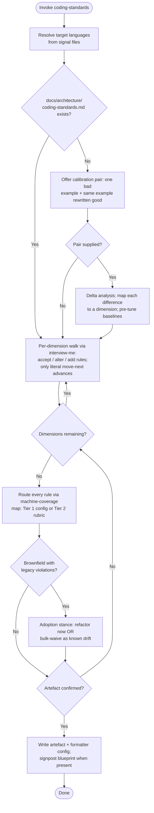

Two modes. **Generate:** no artefact present — full extraction. **Amend:** artefact present — re-walk only dimensions whose baselines changed, preserve all stable IDs, append revision history.



1. PHASE 1 (Detect & Mode): Resolve languages from signal files (`go.mod`, `package.json`, `pyproject.toml`, `Cargo.toml`, `pom.xml`, `*.csproj`). None found → one `interview-me` question; never invent a language set. Artefact present → Amend mode. Absent → Generate mode.

2. PHASE 2 (Calibration pair — Generate only, optional): Offer: "Paste one short example of code you consider bad style, then the same example rewritten to your standard." Supplied → delta analysis: map every difference to a taxonomy dimension and pre-tune that dimension's baselines to the demonstrated preference. Derived rules carry provenance `user-demonstrated` and `[Confidence: Possible]` until confirmed in PHASE 3. Declined → detection/canonical baselines only. Persist the pair verbatim in the artefact's Calibration Exemplar section.

3. PHASE 3 (Walk): Execute `interview-me`. One dimension at a time; present the dimension's full baseline rule table (accept all / alter rows / add rows); only literal `move-next` advances. Baseline precedence: calibration-pair pre-tuning > detected-prevailing (brownfield) > canonical language default. Tag detection-derived rows `[Confidence: Level]` per detection strength. Overriding a detected or default row → provenance `explicit-override`. Fast-path: one "accept all defaults" declaration auto-accepts every remaining dimension with provenance `language-default`. User-declared custom dimensions permitted → provenance `explicit-custom`, forced Tier 2.

4. PHASE 4 (Route): Assign every rule via the machine-coverage map below. Machine-expressible → Tier 1: record mechanism + config key. Otherwise → Tier 2 rubric. Never agent-gate what a machine checks. Comments dimension: reference the `commentary` contract and record the project delta only — never duplicate it. Testing dimension: consume the `detect-test-harness` resolution; never re-derive.

5. PHASE 5 (Adoption stance — brownfield Generate only): Scan existing code against the new rules. Violations force one choice: refactor now, OR bulk-enter as waivers (scope path/Module, reason "known drift — remediate opportunistically"). No third option; chat-level overrides are prohibited.

6. PHASE 6 (Confirm & persist): Present the consolidated artefact in memory. On explicit confirmation → write `docs/architecture/coding-standards.md` and the Tier 1 config at the language-canonical path. `docs/architecture/system-blueprint.md` present → add a one-line signpost to the artefact; never copy rule or waiver rows into the blueprint.

### Taxonomy & machine coverage

Core walk (every language): Naming, Layout, Control Flow, Function Design, Error Handling, Comments, Testing, Dependencies.
Language packs: Go → Concurrency, Interface Design, Visibility. Python → Typing, Mutability. TS/JS → Async, Null Handling. Other languages → one `interview-me` question for pack + canonical source; never invent.

| Dimension | Go | Python | TS/JS |
|---|---|---|---|
| Layout | gofmt, goimports | ruff format | prettier |
| Naming | revive var-naming (partial) | ruff N8xx (partial) | eslint naming-convention (partial) |
| Function Design | gocyclo, funlen (partial) | ruff C90 (partial) | eslint complexity (partial) |
| Error Handling | errcheck (partial) | ruff BLE (partial) | eslint no-floating-promises (partial) |
| Dependencies | gci, go mod tidy | ruff I001 | eslint import/order |
| All remaining dimensions | Agent-gated | Agent-gated | Agent-gated |

Canonical baselines: Go → gofmt + Effective Go + Google Go Style Guide. Python → PEP 8 + ruff defaults. TS/JS → prettier defaults + Airbnb Style Guide.

### Artefact schema

```markdown
# Coding Standards — <project>
Languages: <list> | Version: <n>

## Calibration Exemplar   (omit when not supplied)
<bad/good pair, verbatim>

## <Language>   (repeat per language)
### Tier 1 — Machine-enforced
Config: `<path>` — verify by executing the config, never by inspection.
| RULE-### | Statement | Mechanism |
### Tier 2 — Agent-gated rubric
| RULE-### | Statement | Severity | Provenance | Do | Don't |

## Waiver Register
| WAIVER-### | RULE-### | Scope (path/Module) | Reason |

## Revision History
| Version | Date | Dimensions re-walked |
```

Rule rows: `RULE-###` stable and never reused; statement imperative; tagged `[Enforcement: Machine|Agent]`. Tier 2 rows add `[Review: Priority]` severity, provenance (`detected-prevailing` | `explicit-override` | `language-default` | `explicit-custom` | `user-demonstrated`), and a mandatory do/don't example pair — a rule without a violating example is ungateable.

### Consumers

- `swe` reads the artefact at session start and generates to both tiers.
- `adversarial-review` gates: Tier 1 by executing the config, Tier 2 by rubric review against the do/don't exemplars; waived violations silenced.
- Artefact absent → consumers note absence and proceed without a style contract; never fabricate one.

Directives:
- Machine-first: linter-expressible ⇒ Tier 1. The agent never gates a machine's job.
- All-in-or-nothing: a rule is enforced or waiver-recorded. Untracked overrides (chat instructions, inline comments) are prohibited.
- Waivers: `WAIVER-###` stable IDs; scoped to path/Module + `RULE-###`; reasoned. Waived = silence at the gate.
- Canonical path is the contract; the blueprint signposts, never duplicates.
- Strict `design-vocab` taxonomy. Strict `agent-markup` tokens only.
- Output determinism: same inputs produce structurally identical artefacts.
