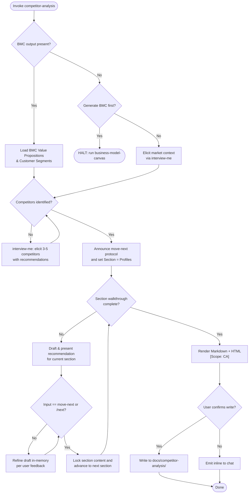

Cross-skill integration: load BMC context before prompting. NEVER re-ask what the BMC already provided. All sections (BMC Baseline, Competitor Profiles, Comparison Matrix, SWOT Summary) MUST exist in the output in fixed order to guarantee consistent schema. NEVER fabricate competitor data — unevidenced fields stay `Unknown — requires verification`.



1. PHASE 0 (Context Discovery & Competitor Identification):
   - Resolve BMC output from `docs/business-model-canvas/` or supplied path. Extract **Value Propositions** and **Customer Segments**.
   - If BMC output is missing: ask ONE `interview-me` decision to generate with `business-model-canvas` first or elicit value propositions and segments interactively.
   - Elicit 3–5 key competitors (name + website). If web search or repo signals are available, present recommended competitors as a baseline. Use `interview-me` for any gaps until 3–5 competitors are confirmed.
   - Announce advancement protocol: answering questions or refining is NOT advancement. Only literal `move-next` or `/next` locks a section and advances.

2. PHASE 1 (Recommendation-Led Section Walkthrough):
   - Walk through the analysis sections in fixed order:
     1. **Competitor Profiles** (one competitor at a time: Strengths, Weaknesses, Pricing Model)
     2. **Comparison Matrix** (dimensions: Features, Pricing, Ease of Use, Support, Market Reach; self vs competitors scores)
     3. **SWOT Summary** (Strengths, Weaknesses, Opportunities, Threats)
   - For each section/competitor: present a synthesized recommendation draft based on discovered data and BMC context.
   - User may critique, question, or request adjustments. Refine the draft in-memory. Answering or discussing does NOT advance.
   - Advance to next section/item ONLY when the user issues `move-next` or `/next`.
   - Support interactive commands: `move-next` / `/next`, `/back`, `/edit <section>`, `/done`, `/status`.

3. PHASE 2 (Render): Compile the completed analysis into two formats:
   - **Markdown** — structured document with BMC Baseline preamble, Competitor Profiles, Comparison Matrix table, and SWOT summary. All 4 sections MUST be present.
   - **HTML** — self-contained page with inline styles: profiles cards, comparison table with alternating row colors, and 2×2 SWOT grid. All sections MUST be rendered. Tag `[Scope: CA]`.

4. PHASE 3 (Output): Present outputs. Offer to write to `docs/competitor-analysis/`. Do not write without explicit confirmation. Fallback: inline display.

Directives:
- Complete Section Coverage: Every output document MUST contain all 4 sections in fixed sequence to guarantee consistent structure. Unanswered fields render as `Unknown — requires verification` or `—`.
- BMC-First: Always establish BMC context before profiling competitors.
- Recommendation-First: Every section begins with the agent's drafted recommendation baseline based on discovered context.
- Strict Advancement: Advancing requires literal `move-next` or `/next`. Never auto-advance on conversational feedback.
- Anti-Fabrication: Never invent facts. Unevidenced fields render as `Unknown — requires verification` or `—`.
- Output Portability: HTML self-contained with inline styles. Markdown valid CommonMark.

Schema `[Scope: CA]`:

```
Input Context (from BMC):
  bmc.value-propositions  <string>
  bmc.customer-segments   <string>

State (in-memory):
  competitors[]: [
    name          <string>
    website       <string>
    strengths     <string>
    weaknesses    <string>
    pricing-model <string>
  ]
  comparison-dimensions[]: [<string>]
  comparison-scores[]: [
    dimension  <string>
    self-score <string>
    competitor-scores: {<name>: <string>}
  ]
  current-phase  <int 0-5>
  current-index  <int>
```

```
Markdown Output:

# Competitor Analysis

## BMC Baseline
### Value Propositions
{bmc content}

### Customer Segments
{bmc content}

## Competitor Profiles
### {Competitor 1}
- **Strengths:** {content}
- **Weaknesses:** {content}
- **Pricing Model:** {content}

### {Competitor 2}
...

## Comparison Matrix
| Dimension | Self | {Comp 1} | {Comp 2} | ... |
| :-- | :-- | :-- | :-- | :-- |
| {dim 1} | {score} | {score} | {score} | ... |
...

## SWOT Summary
### Strengths
- {content}

### Weaknesses
- {content}

### Opportunities
- {content}

### Threats
- {content}
```

```
HTML Output:
Self-contained <!DOCTYPE html> with inline styles.
Sections: BMC Baseline (muted preamble), Competitor Profiles (cards per competitor with Strengths/Weaknesses/Pricing),
Comparison Matrix (HTML table with alternating row colors, header row for Self + competitors),
SWOT Summary (2×2 grid layout).
Empty cells show "—".
Tagged [Scope: CA].
```