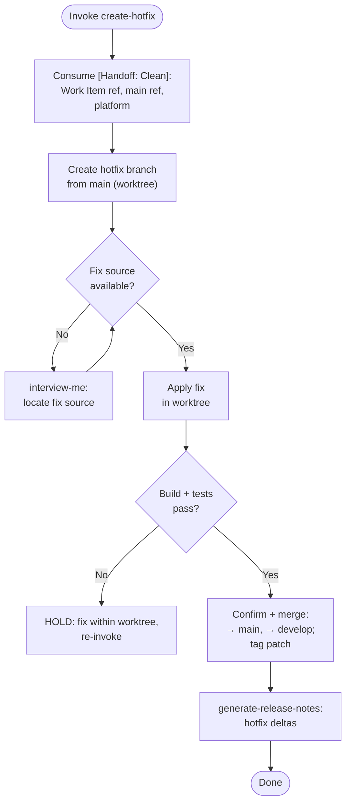

### PHASE 1 — Input & Isolation

**Accepts:** `[Handoff: Clean]` from `devops` PHASE 3
Accepted: Work Item reference (or patch source), main reference/SHA, platform resolution.

1. Consume handoff: Work Item reference (or patch source), main reference/SHA, platform resolution.
2. Operate inside the provided isolated worktree — never the developer's working tree. No worktree supplied → create a transient worktree (`git worktree add <path> <main-reference>`, path under OS temp), removed on exit. Branch, fix, tag, and merge operations run only in the worktree.

### PHASE 2 — Hotfix Branch

1. Create `hotfix/<slug>` from the main reference inside the worktree.
2. Apply the fix: cherry-pick the referenced commit, or apply the provided patch, or reproduce it from the Work Item. Fix source absent → `interview-me` ONE question; never fabricate a fix.

### PHASE 3 — Validation

1. Run the canonical build + tests (`detect-test-harness` for the test invocation).
2. Failure → fix within the worktree and re-validate until green or HOLD for the developer. Never merge a failing hotfix.

### PHASE 4 — Tag

Create annotated patch tag on the hotfix tip.

### PHASE 5 — Merge

1. Via the resolved platform, merge hotfix → main (production) and → develop (integration).
2. Present the exact planned mutation set and require explicit confirmation before any write. No authenticated CLI → emit portable Markdown; never silently mutate.

### PHASE 6 — Release Notes

1. Run `generate-release-notes`: baseline = previous release, scope = hotfix deltas.
2. Attach notes to the release.

Directives:
- Worktree-only mutation: never touch the developer's working tree.
- Anti-fabrication: no fix source / no validation run = stated absence, never invented.
- `[Handoff: Clean]`: Work Item ref + main reference + platform only; no parent reasoning. See `agent-handoff`.
- `agent-markup` tokens and `design-vocab` terms only.
