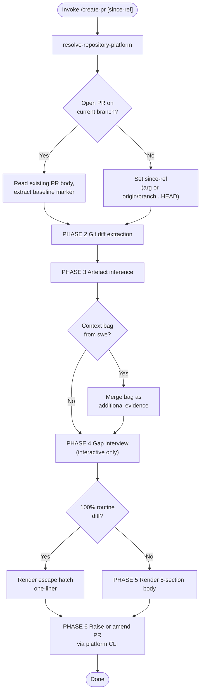

Dual-consumer artefact: human reviewer AND AI reviewer (e.g. `adversarial-review`). Predictable structure + machine-parseable anchors serve both. Sharp compact context — high signal density via strict caps, not omission.



### PHASE 1 — Platform & Branch Verification

1. Run `resolve-repository-platform` once; carry platform + CLI into all operations.
2. Verify current branch is a `feature/*` or `hotfix/*` branch (not `develop`, not `main`). Wrong branch → HALT with message.
3. Detect existing open PR on current branch via platform CLI (e.g. `gh pr list --head <branch> --state open`). Found → amend mode (read body, extract `<!-- create-pr-baseline: <sha> -->` marker, set since-ref to marker SHA). Not found → create mode. Missing marker in existing body → fall back to full-diff inference (graceful degradation).

### PHASE 2 — Git Diff Extraction

Diff from since-ref to HEAD. Extract: commit messages, file deltas, altered Modules/Interfaces/Implementations (per `design-vocab`). Map each changed file to its architectural role. No raw SHAs or author handles in output — summarise at capability/Module Seam.

### PHASE 3 — Artefact Inference

Read repo artefacts as evidence (never paste verbatim). Skip silently if absent — never fabricate.

| Artefact | Path | Signal extracted |
|---|---|---|
| ADRs | `docs/adr/` | Decision rationale + alternatives considered |
| Inline commentary | Source files in diff | Intent behind non-obvious code (per `commentary` archetypes) |
| Requirements | `docs/requirements/` | PRD/FDS traceability — what was supposed to be built |
| Blueprint | `docs/architecture/` | Where code should live — structural conformance check |
| Domain glossary | `docs/domain-glossary.json` | Canonical terminology for consistent phrasing |
| Linked issues | `Closes #N` in commits | Motivation + acceptance criteria context |

### PHASE 4 — Gap Interview (interactive only)

`interview-me` ONE question at a time, recommendation-first, ONLY for residual gaps the artefacts couldn't fill. Headless mode (swe-spawned, no human present): skip unanswered, degrade to inference with `[Confidence: Inferred]` on gap-filled sections.

Typical gaps: motivation/context when no linked issue, key decision rationale when no ADR, review focus when no self-review findings passed.

### PHASE 5 — Render

Render against the fixed 5-section schema. Every section header is a stable `[Section: Name]` token. `file:line` signposts in consistent format for AI extraction.

#### Escape Hatch

If 100% of diff is routine patches, lint corrections, formatting, dependency bumps, or test-only additions with zero structural modifications → collapse to:

```markdown
### [Section: Motivation]
Routine maintenance — [lint/dependency/test/format] cleanup. No structural changes, no review focus required.
```

#### Full Schema `[Scope: Change-Proposal]`

```markdown
<!-- create-pr-baseline: <HEAD-sha> -->

### [Section: Motivation]

[1-3 sentences. WHY this change exists. Linked issue ref (Closes #N). The mindset bridge.]

### [Section: Summary]

- `[feat]` [capability at Module/Interface Seam, ≤12 words]
- `[fix]` [resolved defect, ≤12 words]
- `[refactor]` [structural change, ≤12 words]

### [Section: Key-Decisions]

| file:line | Decision | Rationale |
|---|---|---|
| `path/to/file.ts:87` | [what was decided] | [why — including alternatives rejected, if any] |

*(Omit section entirely if no architectural decisions. Routine changes use escape hatch.)*

### [Section: Review-Focus]

- `path/to/file.ts:112-130` — [what needs reviewer eyes + why]
- `path/to/file.ts:34` — **Breaking:** [what breaks, what was updated in this PR]

*(Accepted findings from self-review (adversarial-review) if passed via context bag:)*
- `path/to/file.ts:55` — Accepted self-review finding `[Review: Should]`: [finding] — accepted because [rationale]

*(Omit section entirely if nothing needs focused review.)*

### [Section: Verification]

[Test approach: what was tested, what wasn't (honest gaps). Red-green-refactor, manual smoke, integration coverage. One paragraph.]
```

### PHASE 6 — Raise or Amend

- **Create mode:** `gh pr create --base develop --head <branch> --title "<derived from motivation>" --body <rendered>`
- **Amend mode:** `gh pr edit <PR-number> --body <rendered>`

Title derivation: concise imperative from Motivation section (≤72 chars). Fallback: last commit message subject if motivation is thin.

### Context Bag (optional, from swe)

When spawned by `swe` PHASE 5, an optional loosely-typed context bag may be passed. Treated as additional evidence — never pasted verbatim into output.

| Field | Source | Role in output |
|---|---|---|
| Task scope | swe PHASE 0/1 | Seeds Motivation section |
| Development decisions (pre-ADR) | swe PHASE 2 | Seeds Key-Decisions section |
| Requirements traceability | swe PHASE 0 pickup | Enriches Motivation (PRD/FDS refs) |
| Test approach | swe PHASE 2 (TDD) | Seeds Verification section |
| Adversarial-review findings + accept/fix decisions | swe PHASE 3-4 | Seeds Review-Focus section — accepted MUST/SHOULD findings become signposted rows |

Absence of any field → inference fills the gap. Absence of entire bag → full inference + interview-if-interactive.

### Directives

- **Inference-first, interview-last:** derive everything possible from git + repo artefacts before asking. Interview fires ONLY for residual gaps in interactive mode.
- **Anti-fabrication:** every claim traces to concrete commit, delta, artefact, or context bag. Never announce unshipped work. Gap-filled sections tagged `[Confidence: Inferred]`.
- **No raw SHAs, author handles, or raw file dumps in output.** Summarise at capability/Module Seam. `file:line` signposts are navigation anchors, not code listings.
- **Tone neutralisation:** single professional voice. Strip sentiment, hedging, blame, profanity.
- **Output determinism:** same inputs (diff + artefacts + bag) produce structurally identical output.
- **Amend-in-place:** re-runs update existing PR body via CLI. Reviewer code-line comments preserved (platform separates body from review comments). Baseline marker embedded as hidden HTML comment.
- **All bracket tokens:** `agent-markup` enumeration only. All architectural terminology: `design-vocab` taxonomy.
- **`[Section: Name]` headers are immutable** — the 5 section names are the stable contract for AI consumers. Never add, rename, or reorder sections.
- **Section suppression:** omit Key-Decisions or Review-Focus sections entirely when empty (routine changes use escape hatch). Motivation, Summary, and Verification are ALWAYS present.
