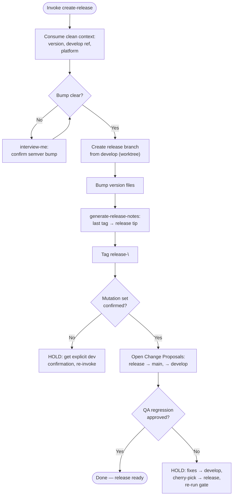

### PHASE 1 — Input & Isolation

1. Consume clean context: target `version`, develop reference/SHA, platform resolution.
2. Operate inside the provided isolated worktree — never the developer's working tree. No worktree supplied → create a transient worktree (`git worktree add <path> <develop-reference>`, path under OS temp), removed on exit. Version bumps, branch, changelog, tag, and merge operations run only in the worktree.

### PHASE 2 — Version Gate

1. Derive semver bump kind from `version` (`major.minor.patch`).
2. Locate version files from repo signals (`package.json`, `VERSION`, version manifest). Ambiguous bump or missing version source → `interview-me` ONE question with a recommendation before mutating anything.

### PHASE 3 — Release Branch

1. Create `release/<version>` from the develop reference inside the worktree.
2. Apply the version bump to every discovered version file in one commit.

### PHASE 4 — Release Notes

1. Run `generate-release-notes`: baseline = last release tag, scope = develop → release tip. No prior tag → state it; never assume a baseline.
2. Attach notes to the release (changelog file + Change Proposal description).

### PHASE 5 — Tag

Create annotated tag `release-<version>` on the release tip.

### PHASE 6 — Change Proposals

1. Via the resolved platform, open Change Proposals merging release → main (production) and release → develop (integration).
2. Present the exact planned mutation set and require explicit confirmation before any write. No authenticated CLI → emit portable Markdown; never silently mutate the tracker.

### PHASE 7 — QA Gate

1. Surface the release → main Proposal for QA `Release-gate` regression (qa persona, its own worktree) on the release branch.
2. Approved → proceed. Rejected → HOLD for the developer: fixes go to develop, cherry-picked into release, gate re-run; re-invoke on fix.
3. No QA result returned → state absence; never claim approval without evidence.

Directives:
- Worktree-only mutation: never touch the developer's working tree.
- Anti-fabrication: no prior tag / no QA return = stated absence, never invented.
- Clean context: version + develop reference + platform only; no parent reasoning.
- `agent-markup` tokens and `design-vocab` terms only.
