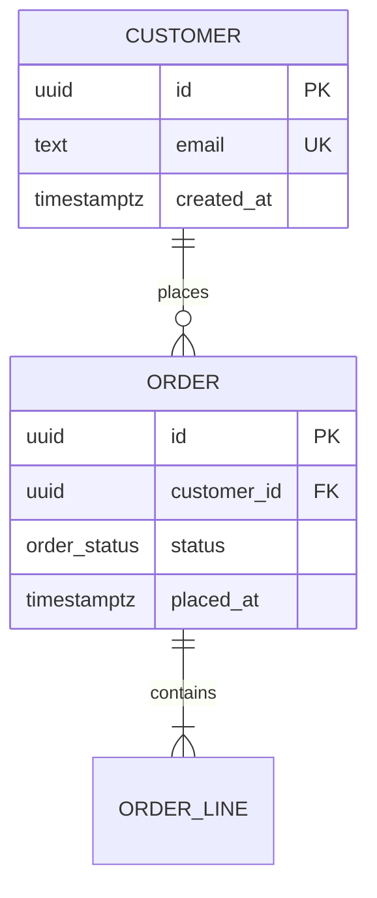

1. PHASE 0 (Source & Mode):
   - Source `spec`: model forward from requirements. Prefer FDS at `docs/requirements/functional-requirements.md`. No FDS → accept direct user spec, announce no FDS traceability.
   - Source `existing-db`: pull live schema, reverse-engineer current entities/relationships, then apply normalisation + anti-pattern sweep to expose defects before emitting target ERD.
   - Mode: `docs/architecture/data-model.md` exists → `amend` (Amendment Protocol); else `create`. Never blind-overwrite.
2. PHASE 1 (Ingestion):
   - Spec path: ingest entities, attributes, validation limits, `[Data: Classification]` tags from FDS/user spec. Extract candidate nouns → Unnormalised Form (UNF).
   - Brownfield: silently parse DDL dumps, migration directories, ORM models (Prisma, EF, ActiveRecord, Django, SQLAlchemy, TypeORM/Sequelize) → reconstruct as-built UNF. Ambiguous → interview, not guess.
   - Relationship Recovery (brownfield): no FK constraint / ambiguous key name (`FKID`, bare `Id`, `TypeId`) → hunt application layer for implied join (ORM associations, JOIN/WHERE, repository/query code). Tag: `Confirmed` = declared FK; `Probable` = code join corroborates; `Possible` = name/convention guess (requires verification).
3. PHASE 2 (Normalisation via Incremental Stage Checkpoints): Drive `interview-me` through Normalisation Stage Ladder ONE stage at a time. Announce checkpoint protocol: present analysis + recommended decomposition for each normal form; user must issue literal `move-next` to lock stage and advance. State dependencies/repeating groups/anomalies found + exact tables to split/merge + baseline recommendation. Answering questions is NOT advancement.
4. PHASE 3 (Anti-Pattern Sweep): Scan candidate model against Anti-Pattern Error Register. Record every match in §6 — never silently normalise one away.
5. PHASE 4 (ERD & Data Dictionary): Compile verified model into `docs/architecture/data-model.md` matching Output Schema. Render ERD as Mermaid `erDiagram`. Document every entity, attribute, key, relationship.

Directives:
- Target: default 3NF. BCNF when overlapping composite candidate keys exist or user requests. 4NF/5NF/6NF advisory only — never auto-fragment.
- Brownfield: never present clean target ERD without first surfacing as-built defects. Value is delta.
- Output Location: exactly `docs/architecture/data-model.md`. Git = version store — no parallel `-vN` files.
- Vocabulary: describe surrounding persistence layer with `design-vocab` (Module, Interface, Implementation, Seam, Adapter). Standard relational terms (entity, table, attribute, PK/FK, junction table, cardinality) are literal domain vocabulary — permitted. Prohibited: component, service, API, boundary.
- Export-clean Markdown per Output Portability Convention.
- Mermaid `erDiagram` with canonical crow's-foot (`||--o{`, `||--|{`, `}o--o{`). ERD ONLY in §2 — never place other diagram types there. Any additional diagrams (normalization stage visualization, anti-pattern topology) MUST be standalone diagrams in their respective sections. One diagram topic per diagram; never conflate.
- Naming: strict, semantic, singular/plural-consistent table/column names. Reject anti-patterns at naming, not after ERD.

Amendment Protocol:
- Diff-Scoped Interview: load existing model, confirm changed entities/requirements, run `interview-me` ONLY over changed areas + FK-related entities.
- Re-Normalise Delta: re-run Normalisation Stage Ladder + Anti-Pattern Sweep over changed entities + FK-related entities.
- Revision History: append row to Document Control table (date, summary, affected entities), bump version. Deprecated entities marked `Deprecated`, never deleted.
- Write-Back: same canonical path. Git = version store.

Normalisation Stage Ladder:
- STAGE 0 — UNF: Extract core entities from requirements/as-built schema. Repeating groups, multi-valued attributes, duplication. Flat starting picture.
- STAGE 1 — 1NF (Atomicity): Every column = single indivisible value; every row unique under declared PK. Split multi-valued attributes (comma-separated lists) into separate rows/tables; assign PKs.
- STAGE 2 — 2NF (No Partial Dependencies): In 1NF + every non-key attribute depends on WHOLE PK. Only relevant for composite keys — extract attributes depending on part of key into own table.
- STAGE 3 — 3NF (No Transitive Dependencies): In 2NF + non-key attributes depend ONLY on key, not on other non-key attributes. "The key, the whole key, and nothing but the key." If A→B and B→C, move C to table keyed by B. Default target.
- STAGE 4 — BCNF (Every determinant is a candidate key): CONDITIONAL — only when overlapping composite candidate keys exist or user requests. Decompose so no part of a candidate key depends on non-key attribute.
- STAGE 5 — Advisory Higher Forms (4NF/5NF/6NF): FLAG multi-valued dependencies (4NF), join dependencies (5NF), temporal-history splits (6NF). Recommend only with explicit justification. Warn: over-fragmentation hurts query performance.

Anti-Pattern Error Register (tag `[Risk: High]` or `Critical`, `[Confidence: Level]`, `[Remediation: Effort]`):
| Anti-Pattern | Why Error | Required Remediation |
| :--- | :--- | :--- |
| Nullable Booleans | Trinary state (True/False/Unknown) hides intent | Non-nullable boolean with explicit default |
| Floating Point for Currency | Precision loss on money | `DECIMAL`/`NUMERIC` |
| Stringly-Typed Data | Dates/UUIDs as `VARCHAR` defeat validation & indexing | Native types: `DATE`/`TIMESTAMPTZ`, `UUID` |
| Magic Numbers | Undocumented integer states | Native `ENUM` or explicit lookup table |
| Polymorphic Associations | `parent_id`+`parent_type` blocks DB-level FKs | Separate FK columns / join tables per relation |
| Comma-Separated Lists | Multi-valued attribute violates 1NF | Junction table |
| Missing Foreign Keys | Referential integrity left to app layer | Enforce FK constraints at database level |
| Ambiguous / Untargeted FK Naming | `FKID`, bare `Id`, `TypeId` — relationship unreadable | Rename to `parent_table_id`; declare FK |
| Entity-Attribute-Value (EAV) | Generic `entity_id`/`attribute`/`value` destroys typing | Model explicit, typed columns/tables |
| Naive Soft Deletes | `is_deleted` breaks `UNIQUE` constraints | Partial unique indexes or archive tables |
| God Tables | Entities > ~30 columns | Split into 1-to-1 related tables |
| Reserved Keywords | `User`/`Order`/`Select` as identifiers → syntax errors | Rename to non-reserved, semantic identifiers |
| Ambiguous Naming | `data`/`value`/`info` carry no meaning | Strict, semantic column names |

Output Schema:

# Persistence Layer Data Model

## 0. Document Control & Revision History
| Version | Date | Change Summary | Affected Entities |
| :--- | :--- | :--- | :--- |

## 1. Source, Target & Scope
* **Input Source:** `spec` (FDS/direct) or `existing-db` — name concrete sources.
* **Target Normal Form:** 3NF (default) or BCNF — state which + why.
* **FDS Traceability:** reference FDS entities/requirements satisfied, or mark `[Inferred: Unverified]`.

## 2. Entity-Relationship Diagram

## 3. Data Dictionary
| Entity | Attribute | Type / Constraints | Key | Nullable | Default | Sensitivity (`[Data: Classification]`) | Notes |
| :--- | :--- | :--- | :--- | :--- | :--- | :--- | :--- |

## 4. Relationship Register
| Relationship | Parent | Child | Cardinality | Foreign Key | On Delete | Junction Table | Source / Confidence |
| :--- | :--- | :--- | :--- | :--- | :--- | :--- | :--- |

## 5. Normalisation Ledger
| Stage | Anomaly / Dependency Found | Decomposition / Action Taken | Resulting Entities |
| :--- | :--- | :--- | :--- |

## 6. Anti-Pattern Findings (Urgent Remediation)
| Finding | Location (Entity.Attribute) | Risk (`[Risk: Level]`) | Confidence (`[Confidence: Level]`) | Remediation | Effort (`[Remediation: Effort]`) |
| :--- | :--- | :--- | :--- | :--- | :--- |

## 7. Advisory Higher-Form Notes (Optional)