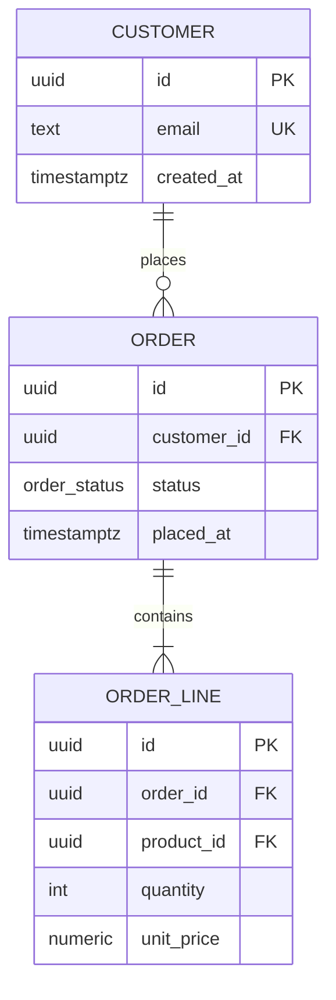

Operational Workflow:
1. PHASE 0 (Source & Mode Selection): Resolve the **input source** and the **mode** before any modelling.
     - Source `spec` (default): model forward from requirements. Prefer the FDS at `docs/requirements/functional-requirements.md` (its entities, Data Invariants, and Validation Schema Matrix are the seed). If no FDS exists, accept the user's direct prose/spec, and announce that the model will proceed without FDS traceability.
     - Source `existing-db`: the user indicates a database already exists. Pull the live schema into context first (see Brownfield Ingestion), reverse-engineer the current entities and relationships, THEN apply the identical normalisation rules and anti-pattern sweep to expose existing defects before emitting the target ERD.
     - Mode: if `docs/architecture/data-model.md` already exists, default to `amend` (run the Amendment Protocol) rather than overwriting; otherwise `create`. Never blind-overwrite an existing model.
2. PHASE 1 (Context Ingestion):
     - Spec path: ingest entities, attributes, validation limits, and `[Data: Classification]` tags from the FDS or user spec. Extract the candidate nouns to seed the Unnormalised Form (UNF).
     - Brownfield path (Brownfield Ingestion): silently parse the authoritative schema sources — `schema.sql`/DDL dumps, migration directories, ORM models (Prisma `schema.prisma`, EF migrations, ActiveRecord/`schema.rb`, Django models, SQLAlchemy, TypeORM/Sequelize entities) — and reconstruct the as-built UNF. Where the schema is ambiguous, resolve via the interview rather than guessing.
     - Relationship Recovery (Brownfield only): do NOT assume relationships are declared. When a foreign-key constraint is absent, or a key column is ambiguously named (e.g. `FKID`, bare `Id`, `TypeId` that never names its parent), hunt the application layer for the implied join — ORM associations, `JOIN`/`WHERE` clauses, repository/query code — to recover the true parent table. Tag every recovered relationship with `[Confidence: Level]`: `Confirmed` only with a declared FK constraint; `Probable` when a code join corroborates it; `Possible` for a name- or convention-only guess (phrased as "requires verification", never asserted). Route genuine ambiguity through the interview rather than inventing an edge.
3. PHASE 2 (Normalisation via Incremental Stage Checkpoints): Drive the `interview-me` skill through the Normalisation Stage Ladder ONE stage at a time. Before the first stage, announce the checkpoint protocol: you will present your analysis and your recommended decomposition for each normal form, keep discussing — answering follow-ups and revising — and the user must issue the literal `move-next` command to lock the stage and advance. For every stage, state which dependencies/repeating groups/anomalies you found and the exact tables you propose to split or merge, with a baseline recommendation. Answering a question is NOT permission to advance.
4. PHASE 3 (Anti-Pattern Sweep): Scan the candidate model against the Anti-Pattern Error Register below and record every match in §6 — never silently normalise one away.
5. PHASE 4 (ERD & Data Dictionary Generation): Compile the verified, normalised model into `docs/architecture/data-model.md`, matching the Output Schema below. Render the ERD as a valid Mermaid `erDiagram` and document every entity, attribute, key, and relationship.

[Operational Directives]
- Execution Protocol: Use `interview-me` mechanics for every normalisation stage and ambiguity. Ask exactly ONE highly specific question at a time and provide a baseline recommendation on each. Honor the advancement contract: never advance a stage until the user issues the literal `move-next` command.
- Target Normal Form: Default target is **3NF** — sufficient for the vast majority of applications. Offer **BCNF** when overlapping composite candidate keys exist or the user requests it. Treat 4NF/5NF/6NF as advisory only (see Stage 5); never auto-fragment to them, as over-decomposition harms query performance.
- Brownfield Honesty: When auditing an existing database, never present a clean target ERD without first surfacing the as-built defects you found. The value is the delta between what exists and what should exist.
- Output Location Contract: The model must be written to exactly `docs/architecture/data-model.md` relative to the repository root. Git is the version store — do NOT create parallel `-vN` files or copies.
- Vocabulary Compliance: Describe the surrounding persistence layer using `design-vocab` (Module, Interface, Implementation, Seam, Adapter). Standard relational terms (entity, table, attribute, primary/foreign key, junction table, cardinality) are literal domain vocabulary and are permitted; the prohibited synonyms (component, service, API, boundary) are not.
- Markup Compliance: Restrict bracket-token values to the `agent-markup` enumerations. Author the document as export-clean Markdown per the Output Portability Convention.
- Visuals: All diagrams must be valid Mermaid.js (`erDiagram`) code blocks. Use canonical crow's-foot cardinality (`||--o{`, `||--|{`, `}o--o{`).
- Naming Discipline: Enforce strict, semantic, singular-or-plural-consistent table and column names and reject the anti-patterns below at the point of naming, not after the ERD is drawn.

[Amendment Protocol]
When the model runs in `amend` mode, the existing `docs/architecture/data-model.md` is the authoritative baseline — you are editing it, not regenerating it:
- Diff-Scoped Interview: Load the existing model, confirm exactly which entities/requirements changed, and run `interview-me` ONLY over those areas. Carry unchanged entities forward verbatim.
- Re-Normalise the Delta: Re-run the Normalisation Stage Ladder and the Anti-Pattern Sweep over the changed entities and any entity related to them by a foreign key, so a new attribute cannot reintroduce a partial/transitive dependency unnoticed.
- Revision History: Append a row to the Document Control table (date, change summary, affected entities) and bump the document version. Never delete retired entities silently — mark them `Deprecated` and retain them for history.

================================================================================
[Normalisation Stage Ladder] — one checkpoint per stage
================================================================================
- STAGE 0 — Conceptual / Unnormalised Form (UNF): Extract core entities (nouns) from the requirements or as-built schema. Expect repeating groups, multi-valued attributes, and duplication. Present the flat starting picture.
- STAGE 1 — First Normal Form (1NF) — Atomicity: Every column holds a single indivisible value; every row is unique under a declared primary key. ACTION: split multi-valued attributes (e.g. comma-separated lists) into separate rows/tables; assign primary keys.
- STAGE 2 — Second Normal Form (2NF) — No Partial Dependencies: Model is in 1NF and every non-key attribute depends on the WHOLE primary key. ACTION: only relevant for composite keys — extract attributes that depend on part of the key into their own table.
- STAGE 3 — Third Normal Form (3NF) — No Transitive Dependencies: Model is in 2NF and non-key attributes depend ONLY on the key, not on other non-key attributes. "The key, the whole key, and nothing but the key." ACTION: if A -> B and B -> C, move C to a table keyed by B. (Default target — stop here unless BCNF is warranted.)
- STAGE 4 — Boyce-Codd Normal Form (BCNF, "3.5NF") — CONDITIONAL: Every determinant is a candidate key. ACTION: trigger only when overlapping composite candidate keys exist or the user requests BCNF; decompose so no part of a candidate key depends on a non-key attribute.
- STAGE 5 — Advisory Higher Forms (4NF/5NF/6NF) — FLAG ONLY: Note multi-valued dependencies (4NF), join dependencies (5NF), or temporal-history splits (6NF) if present, but recommend them only with explicit justification. Warn that over-fragmentation hurts query performance.

================================================================================
[Anti-Pattern Error Register] — always flag detected instances as urgent
================================================================================
*(Every match is a design error. Tag inline with `[Risk: High]` — or `[Risk: Critical]` where it threatens integrity or leaks `Special-Category` data — plus `[Confidence: Level]` and `[Remediation: Effort]`, and record it in the Anti-Pattern Findings section. Never ship a model that silently contains these.)*
| Anti-Pattern | Why It Is an Error | Required Remediation |
| :--- | :--- | :--- |
| Nullable Booleans | Trinary state (True/False/Unknown) hides intent | Non-nullable boolean with an explicit default |
| Floating Point for Currency | Precision loss on money maths | Use `DECIMAL`/`NUMERIC` |
| Stringly-Typed Data | Dates/UUIDs as `VARCHAR` defeat validation & indexing | Native types: `DATE`/`TIMESTAMPTZ`, native `UUID` |
| Magic Numbers | Undocumented integer states | Native `ENUM` type or explicit lookup table |
| Polymorphic Associations | `parent_id`+`parent_type` blocks DB-level FKs | Separate FK columns / join tables per relation |
| Comma-Separated Lists | Multi-valued attribute violates 1NF | Extract into a proper junction table |
| Missing Foreign Keys | Referential integrity left to the app layer | Enforce FK constraints at the database level |
| Ambiguous / Untargeted FK Naming | `FKID`, bare `Id`, or `TypeId` that never names its parent table — relationship is unreadable from the schema | Rename to `parent_table_id`; declare the FK so the target is explicit |
| Entity-Attribute-Value (EAV) | Generic `entity_id`/`attribute`/`value` destroys typing & performance | Model explicit, typed columns/tables |
| Naive Soft Deletes | `is_deleted` flag breaks `UNIQUE` constraints (e.g. re-registering an email) | Partial unique indexes or archive tables that account for deletion |
| God Tables | Entities sprawling past ~30 columns | Split into 1-to-1 related tables |
| Reserved Keywords | `User`/`Order`/`Select` as identifiers cause syntax errors | Rename to non-reserved, semantic identifiers |
| Ambiguous Naming | `data`/`value`/`info` carry no meaning | Strict, semantic column names |

================================================================================
[Output Schema] — docs/architecture/data-model.md
================================================================================

# Persistence Layer Data Model

## 0. Document Control & Revision History
*(Append a row on every amendment; git stores the full diff.)*
| Version | Date | Change Summary | Affected Entities |
| :--- | :--- | :--- | :--- |
| *1.0* | *2026-06-29* | *Initial normalised data model.* | *Customer, Order, OrderLine* |

## 1. Source, Target & Scope
* **Input Source:** `spec` (FDS / direct) or `existing-db` (reverse-engineered) — name the concrete sources ingested.
* **Target Normal Form:** 3NF (default) or BCNF — state which and why.
* **FDS Traceability:** Reference the FDS entities/requirements this model satisfies, or mark `[Inferred: Unverified]` where a structure has no spec origin.

## 2. Entity-Relationship Diagram
*(Valid Mermaid `erDiagram`. Crow's-foot cardinality. Every entity from the data dictionary appears here.)*

## 3. Data Dictionary
*(One block per entity. Tag every attribute's sensitivity with `[Data: Classification]`; treat `Special-Category` (GDPR Art. 9) as the strictest tier.)*
| Entity | Attribute | Type / Constraints | Key | Nullable | Default | Sensitivity (`[Data: Classification]`) | Notes |
| :--- | :--- | :--- | :--- | :--- | :--- | :--- | :--- |
| *Customer* | *email* | *text, format-validated* | *UK* | *No* | *—* | *PII* | *Unique even across soft-deletes* |

## 4. Relationship Register
*(`Source / Confidence`: declared-FK `[Confidence: Confirmed]`, code-inferred `[Confidence: Probable]`, name/convention guess `[Confidence: Possible]`, or interview-confirmed.)*
| Relationship | Parent | Child | Cardinality | Foreign Key | On Delete | Junction Table | Source / Confidence |
| :--- | :--- | :--- | :--- | :--- | :--- | :--- | :--- |
| *Customer→Order* | *Customer* | *Order* | *1:N* | *order.customer_id* | *Restrict* | *—* | *declared-FK [Confidence: Confirmed]* |
| *Invoice→Customer* | *Customer* | *Invoice* | *1:N* | *invoice.FKID (untargeted)* | *unknown* | *—* | *code-inferred [Confidence: Probable]* |

## 5. Normalisation Ledger
*(Record the decision taken at each stage so the model's structure is defensible.)*
| Stage | Anomaly / Dependency Found | Decomposition / Action Taken | Resulting Entities |
| :--- | :--- | :--- | :--- |
| *1NF* | *tags stored as CSV in product.tags* | *extracted to product_tag junction* | *Product, Tag, ProductTag* |

## 6. Anti-Pattern Findings (Urgent Remediation)
*(Brownfield audits and spec drift land here. Empty only if the sweep found nothing.)*
| Finding | Location (Entity.Attribute) | Risk (`[Risk: Level]`) | Confidence (`[Confidence: Level]`) | Remediation | Effort (`[Remediation: Effort]`) |
| :--- | :--- | :--- | :--- | :--- | :--- |
| *Floating point for currency* | *Order.total* | *[Risk: High]* | *[Confidence: Confirmed]* | *Change to NUMERIC(12,2)* | *[Remediation: Low]* |

## 7. Advisory Higher-Form Notes (Optional)
*(4NF/5NF/6NF observations with explicit justification only — never auto-applied.)*
