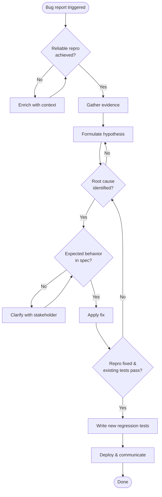

# Skill: debug

## Workflow

## Phases

### 1. Verify & Reproduce
- Confirm the bug exists. Obtain a reliable, minimal reproduction case.
- Capture environment: OS, runtime version, dependencies, config, input data.
- If reproduction is intermittent, enrich with telemetry, logging, or stress testing until reliable.
- If `create-bug-report` is available, run it to formalise the bug evidence before proceeding.

### 2. Gather Evidence
- Collect logs, stack traces, metrics, state snapshots, and git history (blame, recent changes).
- Prioritise evidence that narrows the search space: change sets, error deltas, A/B comparisons.

### 3. Formulate Hypothesis
- Use binary search, divide & conquer, or cause-effect reasoning to isolate root cause.
- Test one hypothesis at a time. If disproven, loop back with narrower scope.
- If `interview-me` is available, escalate when systematic narrowing stalls.

### 4. Requirements Check
- Compare the identified root cause against the specification (PRD, FDS, documented contract).
- If the behavior matches the spec, the issue is a feature request or misunderstanding — close the bug, re-categorise, and stop.
- If requirements are ambiguous, clarify with stakeholder before proceeding.

### 5. Apply Fix
- Implement the minimal change that resolves the bug given the identified root cause.
- Verify the fix against the reproduction case immediately. If the reproduction does not clear, revisit the root cause.

### 6. Validate
- Run the reproduction case to confirm the bug is gone.
- Run the existing test suite to confirm no regressions.
- If validation fails, loop back to root cause check — the hypothesis or fix may be wrong.

### 7. Write Regression Tests
- Add tests that would have caught this bug at the affected seam.
- Follow the project's existing test framework and conventions. Run `detect-test-harness` first if available to resolve the runner and layout.
- Verify new tests fail on the unfixed code and pass on the fix.

### 8. Deploy & Communicate
- Deploy via the project's release workflow.
- Communicate: what was broken, what the fix was, any workarounds needed.
- If a bug report was created, update it with resolution notes and close it.

## Directives

- **One hypothesis at a time**: Never test multiple hypotheses in parallel. Sequential elimination narrows root cause deterministically.
- **Reproduction before fix**: Never begin a fix without a reliable reproduction. If you cannot reproduce, do not fix.
- **Minimal fix first**: Apply the smallest change that resolves the bug. Avoid scope creep.
- **Evidence over intuition**: Every hypothesis must be grounded in evidence. If evidence is insufficient, gather more before guessing.
- **Requirements after root cause**: Check expected behavior against the spec only after the root cause is identified — premature requirements analysis wastes time if the root cause is never found.
