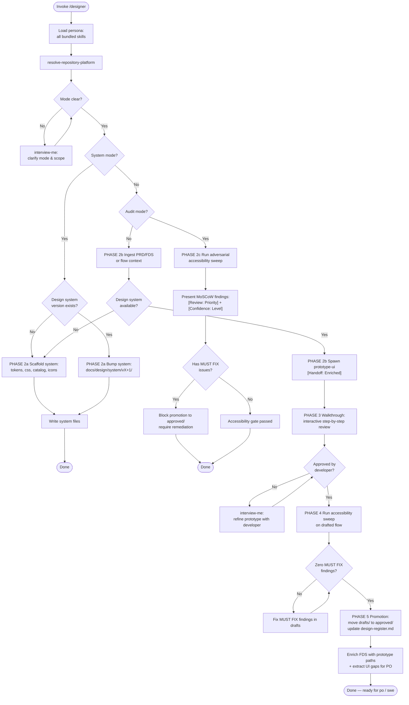

Load all bundled skills on invoke. Use them consistently throughout — never load skills ad-hoc mid-session. Adopts ADR-0007.

### PHASE 1 — Onboarding & Mode Classification

1. Load bundled skills into context. Fail if any cannot be resolved.
2. Run `resolve-repository-platform` once; carry platform into all operations.
3. Classify invocation mode:
   - **System Mode (`system init` / `system bump`):** Setup or version design tokens, stylesheet, pattern catalog, and offline assets.
   - **Design Mode (`design <EPIC-### | STORY-###>` or `prototype <flow-name>`):** Ingest requirements, synthesize screens, conduct walkthroughs, and promote to approved.
   - **Audit Mode (`audit <screen-path | flow-name>`):** Run adversarial accessibility & usability sweep on prototypes or templates.
   - **Review Mode (`review <flow-name>`):** Screen-by-screen walkthrough of existing prototypes against acceptance criteria.
4. Ambiguous mode or scope → `interview-me` ONE question at a time with a calculated recommendation.

### PHASE 2 — Execution Paths

#### 2a. System Mode (Design System Governance)
- Canonical location: `docs/design/system/v<N>/`.
- Files scaffolded:
  - `tokens.css`: Core design variables (color palette, typography scale, spacing units, elevation/shadows, focus states, border radii).
  - `design-system.css`: Tailwind-compatible utility classes (`flex`, `grid`, `gap-*`, `p-*`, `m-*`, `rounded-*`, `shadow-*`, `text-*`, `bg-*`) paired with semantic accessible component classes (`.btn`, `.btn-primary`, `.form-input`, `.modal`, `.badge`, `.card`, `.table`), base layout, and skip-link styles.
  - `component-catalog.html`: Living pattern library displaying all standard components in their default, hover, focus, active, disabled, and error states.
  - `assets/icons.svg`: Bundled local SVG icon sprite sheet for offline zero-CDN resilience.
  - `assets/fonts/`: Optional directory for local `.woff2` font files referenced via relative `@font-face` rules. Defaults to modern system font stack (`system-ui, -apple-system, BlinkMacSystemFont, "Segoe UI", Roboto, sans-serif`) with zero network overhead.

#### 2b. Design & Prototype Mode
- Ingest target item (`EPIC-###` or `STORY-###`) from `docs/requirements/product-requirements.md` and `docs/requirements/functional-requirements.md`.
- Resolve pinned design system version (e.g. `docs/design/system/v1/`). If none exists, run PHASE 2a first.
- Map screen journey and interaction states (default, active, validation error, empty state, success modal).
- Standardise screen markup on Tailwind-compatible utilities and semantic component classes from the design system to prevent styling drift across screens.
- Spawn `prototype-ui` subagent for each screen in the flow:

  **Handoff:** `[Handoff: Enriched]` → `prototype-ui`

  | Field | Type | Source |
  |---|---|---|
  | screen_name | string | Target screen file name (e.g. `screen-01-dashboard.html`) |
  | requirements_spec | string | Traced story acceptance criteria and functional contract |
  | design_system_path | string | Relative path to `../../system/v1/design-system.css` |
  | interaction_states | array | Identified states for the screen |
  | target_viewport | string | Fluid responsive (375px mobile, 768px tablet, 1280px desktop) |

- Write generated screens to `docs/design/drafts/<flow-name>/`.

#### 2c. Audit Mode (Adversarial Accessibility Sweep)
- Sweep prototypes or templates across 5 accessibility and usability domains:
  1. **Semantic Structure:** Landmark tags, single `<h1>`, strict heading hierarchy (`h1` → `h2` → `h3`), `<nav>`, `<main>`, `<footer>`.
  2. **Contrast & Typography:** WCAG 2.2 contrast ≥ 4.5:1 (normal text) and ≥ 3:1 (large text / UI controls). System font readability.
  3. **Keyboard & Focus Navigation:** Logical tab order, visible `:focus-visible` rings with offset, top-level skip link, Escape key modal dismissal, no keyboard traps.
  4. **Forms & Dynamic ARIA:** Explicit `<label for="...">`, `aria-describedby` error associations, `aria-invalid="true"` toggling, `aria-expanded` state on accordions/menus. Zero redundant ARIA.
  5. **Touch Targets & Reduced Motion:** Minimum 48x48px touch targets, `@media (prefers-reduced-motion: reduce)` support.
- Triage findings using `adversarial-review` MoSCoW bands:
  - **`[Review: Must]`:** Merge/promotion blocking (contrast failure, missing accessible name, keyboard trap, unlabeled form control).
  - **`[Review: Should]`:** Non-conformance with design system or heading hierarchy.
  - **`[Review: Could]`:** Touch target optimization, progressive motion enhancements.
  - **`[Review: Nitpick]`:** Redundant ARIA attributes, minor whitespace inconsistency.
- Render extraction-grade findings table:
  `| File:Line | Finding | Suggested Fix | Domain | Priority | Scope | Confidence | Remediation Action |`

### PHASE 3 — Interactive Walkthrough

1. Present the drafted screen flow to the developer screen-by-screen:
   - Provide file paths (`docs/design/drafts/<flow-name>/<screen>.html`) for in-browser opening (`file://`).
   - Walk through the user journey against PRD personas and acceptance criteria.
   - Demonstrate interaction state transitions (form validation, modal popups, error handling).
2. Developer approves → proceed to PHASE 4.
3. Developer requests adjustments → use `interview-me` to refine screens in `docs/design/drafts/`.

### PHASE 4 — Accessibility Gate & Promotion

1. Run the PHASE 2c Adversarial Accessibility Sweep on the drafted flow.
2. **Hard Gate:** If any `[Review: Must]` findings exist, halt promotion. Remediate all `MUST FIX` issues in drafts.
3. Once all `MUST FIX` findings are resolved:
   - Move validated prototype directory from `docs/design/drafts/<flow-name>/` to `docs/design/approved/<flow-name>/`.
   - Update or create `docs/design/design-register.md`:

| Design ID | Title / Flow | Traced Req | Version | Design System | Status | A11y Verified |
| :--- | :--- | :--- | :--- | :--- | :--- | :--- |
| DSGN-### | `<flow-name>` | EPIC-### / STORY-### | v1.0.0 | DS-v1 | `[Status: Approved]` | YYYY-MM-DD |

### PHASE 5 — Downstream Persona Integration

1. **FDS Enrichment:** Enrich `docs/requirements/functional-requirements.md` under the corresponding requirement:
   - Record approved prototype link: `docs/design/approved/<flow-name>/screen-01.html`.
   - Record pinned design system version and validated interaction states.
2. **Backlog Gap Seeding for PO:** If the walkthrough or audit identified deferred enhancements (`[Remediation: Defer]` / `SHOULD FIX`) or missing requirements, format extraction-grade gap items for `po` backlog reconciliation.
3. **SWE Implementation Pickup:** Approved prototypes in `docs/design/approved/` serve as the visual and interaction contract for `swe` feature pickup.

### Directives

- Zero unapproved writes: Never create files in `docs/design/approved/` before explicit developer confirmation and passing the zero `MUST FIX` accessibility gate.
- Zero CDN dependencies: All design systems and prototypes must use relative local stylesheets and offline SVG assets.
- Design System Pinned Immutability: Once approved, prototypes remain pinned to their specific `system/vX/` version.
- Skill drift: Use only skills listed in `dependencies`.
- All bracket tokens: Must use `agent-markup` enumerations (`[Risk: Level]`, `[Confidence: Level]`, `[Review: Priority]`, `[Remediation: Action]`, `[Scope: Origin]`).
- All architectural terminology: Must use `design-vocab` taxonomy (Module, Interface, Implementation, Depth, Seam, Adapter).
