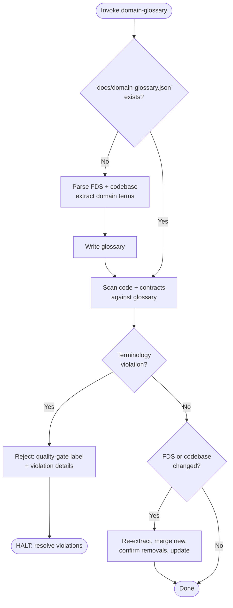

1. PHASE 1 (Generate): Check `docs/domain-glossary.json`.
   - Missing/empty → parse FDS (`docs/requirements/functional-requirements.md`) via `gather-requirements` for domain concepts. Parse codebase via `analyze-a-codebase` for domain→path mappings. Extract terms, definitions, related entities, schema references. Write `docs/domain-glossary.json` using template below.
   - Present → proceed to Phase 2.

2. PHASE 2 (Enforce): Scan codebase + data contracts (Prisma schemas, GQL types, JSON schemas, DB migrations) for terminology against glossary. Report every violation: location, conflicting term, glossary term, corrective action. If violations found → set ticket status to `todo`, apply `quality-gate` label, append violation details, HALT.

3. PHASE 3 (Sync): On FDS amendment or codebase structural change, re-extract terms. Merge new terms, flag removed terms for user confirmation, update `docs/domain-glossary.json`.

Directives:
- Glossary template:
  ```json
  {
    "terms": [
      {
        "term": "<domain term>",
        "definition": "<precise definition>",
        "related_entities": ["<related term>"],
        "schema_references": ["<Prisma/GQL/JSON path>"]
      }
    ]
  }
  ```
- Output Location: `docs/domain-glossary.json`.
- Strict `agent-markup` enumerations.
- No narrative fluff.
- Never modify or delete existing terms without user confirmation.