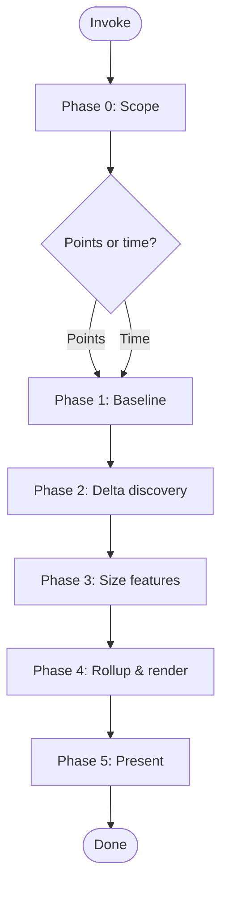

# Skill: estimation

## Overview

Sizes requirements against a PRD/FDS baseline. Produces a timestamped estimate (story points or time) with per-feature rationale, confidence range, and a client-ready HTML report. All artifacts are out-of-tree.

## Workflow

## Phase 0: Scope

Ask: **story points (agile velocity)** or **time (days)**? If story points, ask for current velocity (points per sprint, default 10). Honor `argument-hint` if provided.

## Phase 1: Baseline

Load PRD at `docs/requirements/product-requirements.md` and FDS at `docs/requirements/functional-requirements.md`. If either is missing, HALT: *"Run gather-requirements first."* Extract the Feature-### list.

## Phase 2: Delta discovery

Invoke `gather-requirements` in amend mode. Intercept write-back: redirect delta to memory, not disk. If no delta, proceed with baseline only.

## Phase 3: Sizing interview

For each Feature-### in scope (baseline + delta) using `interview-me`:

- **Time (days):** Ask *"Low / Best / High estimate in person-days?"* Recommended: Low = Best × 0.67, High = Best × 1.5. Capture prose rationale.
- **Story points:** Ask *"S / M / L / XL?"* (S=1, M=3, L=5, XL=8). Recommended: M unless evidence suggests otherwise. Capture prose rationale.

Tag each with `[Confidence: Level]`. If user hesitates or rationale is thin, use `[Confidence: Low]`.

## Phase 4: Rollup & render

**Rollup:** Sum Low/Best/High (time) or point values (story points). If story points, divide by velocity → sprint count. Narrow confidence range if all `[Confidence: High]`; widen if mixed.

**Render two artifacts:**
1. **Timestamped MD** at `{state_dir}/estimate-YYYYMMDD-HHMMSS.md` — disposable, overwritten next run. Per-feature breakdown, rationale, rollup, confidence.
2. **HTML report** at `{state_dir}/estimate-YYYYMMDD-HHMMSS.html` — persistent, client-ready. Executive summary (total, sprint count, assumptions, confidence) then detailed breakdown (per Feature-### with estimates, rationale, delta marker).

`{state_dir}` resolves per platform:
- macOS: `~/Library/Application Support/estimation/`
- Linux: `~/.local/state/estimation/`
- Windows: `%LOCALAPPDATA%/estimation/`

## Phase 5: Present

Print the HTML report path. Offer to re-run with different scope, estimate type, or velocity.

## Anti-hallucination

- Never fabricate a Feature-### not in the PRD/FDS.
- Never fabricate baseline counts, velocity, or sprint counts.
- If `gather-requirements` is unavailable, HALT: *"gather-requirements required for delta."*
- If `interview-me` is unavailable, fall back to manual questions.
- All estimates must be explicitly provided by the user. Never invent.
- All artifacts are out-of-tree. Never write to the working tree.