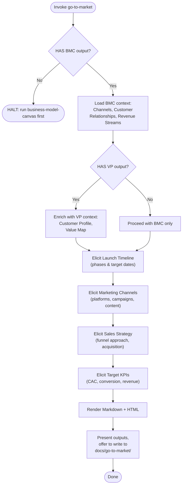

Cross-skill integration: load BMC context before prompting. NEVER re-ask what the BMC already provided. NEVER fabricate plan content — unevidenced fields stay `TBD — requires decision`.



1. PHASE 0 (Load Context): Resolve BMC output from `docs/business-model-canvas/` or provided path. Extract **Channels**, **Customer Relationships**, and **Revenue Streams**. If no BMC output found: report `BMC output not found — run business-model-canvas first` and halt. Then check for VP output at `docs/value-proposition-canvas/`. If found, extract **Customer Profile** (Customer Jobs, Pains, Gains) and **Value Map** (Products & Services, Pain Relievers, Gain Creators) as enrichment context. Display extracted context as baseline.

2. PHASE 1 (Launch Timeline): Ask the user to define 3–5 launch phases with target dates or milestones. Present one phase at a time. Support `/next`, `/back`, `/edit <phase>`, `/done`, `/status`.
   - Prompt: "Define phase {N}: name, target date or milestone, and key objective."
   - Suggested default phases: Pre-launch / Waitlist, Alpha / Closed Beta, Public Beta, General Availability (GA). User may rename, add, or skip.
   - Store as `timeline[]` array of `{phase, date, objective}`.

3. PHASE 2 (Marketing Channels): Elicit specific marketing channels and campaigns. Tie each prompt to the BMC Channels and Customer Segments. Present one channel at a time. Support same interactive commands. For each channel collect: platform/campaign name, target segment, content strategy, budget tier (Low/Medium/High).
   - Prompt: "Channel {N}: What specific platform, campaign, or content strategy will reach {segments}?"

4. PHASE 3 (Sales Strategy): Elicit the sales approach. Reference the BMC Customer Relationships and Revenue Streams. Collect three structured fields per session:
   - **Primary Funnel** — inbound, outbound, product-led growth, or hybrid?
   - **Lead Qualification** — How are leads scored or qualified before handoff?
   - **Conversion Milestones** — Key stages from lead to paying customer (e.g., demo → trial → purchase).

5. PHASE 4 (Target KPIs): Elicit key performance indicators. Collect one metric at a time. Pre-populate with standard launch metrics, editable by user. Support `/done` to finish:
   - **Customer Acquisition Cost (CAC)** — target $ per acquired customer
   - **Activation Rate** — % of signups reaching first value
   - **Conversion Rate** — % of leads → paying customers
   - **Monthly Recurring Revenue (MRR) Target** — 30/60/90 day targets
   - **Net Promoter Score (NPS) Target** — post-launch survey goal

6. PHASE 5 (Render): Compile the completed GTM plan into two formats:
   - **Markdown** — structured document with: BMC/VP Baseline preamble, Phased Timeline table, Marketing Channels per segment, Sales Strategy section, KPI dashboard.
   - **HTML** — self-contained page with inline styles: timeline as a vertical road-map with phase blocks, marketing channels as cards, KPI dashboard as a metrics grid, sales strategy as a prose section. Tag `[Scope: GTM]`.

7. PHASE 6 (Output): Present both outputs. Offer to write to `docs/go-to-market/`. Do not write without explicit confirmation. Chat-only fallback: display inline.

Directives:
- BMC-First: Always establish baseline before the first GTM prompt.
- No Redundancy: Never ask the user to re-state content already captured in the BMC or VP. Reference it.
- One Phase at a Time: Present exactly one phase, channel, or KPI per interaction.
- Content-First: User's natural-language response IS the content. Store verbatim.
- Anti-Fabrication: Never invent launch plans, budgets, or targets. Unevidenced = `TBD — requires decision`.
- Empty Cells: Unanswered fields render as `—` (em dash) in output tables.
- Output Portability: HTML self-contained (inline styles). Markdown valid CommonMark.

Schema `[Scope: GTM]`:

```
Input Context (from BMC):
  bmc.channels                <string>
  bmc.customer-relationships  <string>
  bmc.revenue-streams         <string>

Optional Context (from VP):
  vp.customer-jobs     <string>
  vp.pains             <string>
  vp.gains             <string>
  vp.products-services  <string>
  vp.pain-relievers    <string>
  vp.gain-creators     <string>

State (in-memory):
  timeline[]: [
    phase       <string>
    date        <string>
    objective   <string>
  ]
  marketing-channels[]: [
    platform    <string>
    segment     <string>
    strategy    <string>
    budget      <string>
  ]
  sales-strategy:
    primary-funnel          <string>
    lead-qualification      <string>
    conversion-milestones   <string>
  kpis[]: [
    metric      <string>
    target      <string>
  ]
  current-phase  <int 0-6>
  current-index  <int>
```

```
Markdown Output:

# Go-To-Market Plan

## BMC Baseline
### Channels
{bmc content}
### Customer Relationships
{bmc content}
### Revenue Streams
{bmc content}

## Value Proposition Baseline (if available)
### Customer Profile
{imported VP content}
### Value Map
{imported VP content}

## Launch Timeline
| Phase | Target Date | Objective |
| :-- | :-- | :-- |
| {phase 1} | {date} | {objective} |
| ... | ... | ... |

## Marketing Channels
### {Channel 1}
- **Platform:** {content}
- **Target Segment:** {content}
- **Strategy:** {content}
- **Budget:** {content}
### {Channel 2}
...

## Sales Strategy
- **Primary Funnel:** {content}
- **Lead Qualification:** {content}
- **Conversion Milestones:** {content}

## Target KPIs
| Metric | Target |
| :-- | :-- |
| {metric 1} | {target} |
| ... | ... |
```

```
HTML Output:
Self-contained <!DOCTYPE html> with inline styles.
Sections:
1. BMC Baseline (muted preamble)
2. VP Baseline (muted preamble, conditional — only if VP data loaded)
3. Launch Timeline (vertical roadmap with colored phase blocks connected by a timeline line)
4. Marketing Channels (grid of cards per channel, each showing platform, segment, strategy, budget)
5. Sales Strategy (prose section with three sub-headings)
6. KPI Dashboard (grid of metric cards with target values, colored green/amber/red by confidence)
Empty cells show "—".
Tagged [Scope: GTM].
```