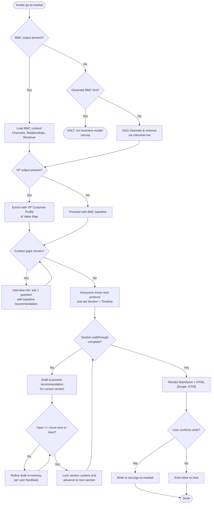

Cross-skill integration: load BMC context before prompting. NEVER re-ask what the BMC already provided. All sections (Baseline, Launch Timeline, Marketing Channels, Sales Strategy, Target KPIs) MUST exist in the output in fixed order to guarantee consistent schema. NEVER fabricate plan content — unevidenced fields stay `TBD — requires decision`.


```mermaid
flowchart TD
    START(["Invoke go-to-market"]) --> D1{"BMC output present?"}
    D1 -->|Yes| P1["Load BMC context:\nChannels, Relationships, Revenue"]
    D1 -->|No| D_GEN{"Generate BMC first?"}
    D_GEN -->|Yes| P_HALT(["HALT: run business-model-canvas"])
    D_GEN -->|No| P2["Elicit channels & revenue\nvia interview-me"]
    P1 --> D_VP{"VP output present?"}
    P2 --> D_VP
    D_VP -->|Yes| P3["Enrich with VP Customer Profile\n& Value Map"]
    D_VP -->|No| P4["Proceed with BMC baseline"]
    P3 --> D2{"Context gaps remain?"}
    P4 --> D2
    D2 -->|Yes| P5["interview-me: ask 1 question\nwith baseline recommendation"]
    P5 --> D2
    D2 -->|No| P6["Announce move-next protocol\nand set Section = Timeline"]
    P6 --> D_SEC{"Section walkthrough\ncomplete?"}
    D_SEC -->|No| P7["Draft & present recommendation\nfor current section"]
    P7 --> D_ADV{"Input == move-next or /next?"}
    D_ADV -->|No| P8["Refine draft in-memory\nper user feedback"]
    P8 --> D_ADV
    D_ADV -->|Yes| P9["Lock section content and\nadvance to next section"]
    P9 --> D_SEC
    D_SEC -->|Yes| P10["Render Markdown + HTML\n[Scope: GTM]"]
    P10 --> D_WRT{"User confirms write?"}
    D_WRT -->|Yes| P11["Write to docs/go-to-market/"]
    D_WRT -->|No| P12["Emit inline to chat"]
    P11 --> DONE(["Done"])
    P12 --> DONE
```

1. PHASE 0 (Context Discovery & Gap Interview):
   - Resolve BMC output from `docs/business-model-canvas/` or supplied path. Extract **Channels**, **Customer Relationships**, and **Revenue Streams**.
   - If BMC output is missing: ask ONE `interview-me` decision to generate with `business-model-canvas` first or elicit baseline channels/revenue interactively.
   - Check for optional VP output at `docs/value-proposition-canvas/`. If present, extract **Customer Profile** and **Value Map** as enrichment context.
   - For missing launch and market context: drive `interview-me` asking ONE question at a time, each with a calculated baseline recommendation, until shared understanding is reached.
   - Announce advancement protocol: answering questions or refining is NOT advancement. Only literal `move-next` or `/next` locks a section and advances.

2. PHASE 1 (Recommendation-Led Section Walkthrough):
   - Walk through the 4 GTM sections in fixed sequence:
     1. **Launch Timeline** (3–5 phases: e.g., Pre-launch/Waitlist, Beta, GA with dates & key objectives)
     2. **Marketing Channels** (platforms, target segments, content strategy, budget tier per channel)
     3. **Sales Strategy** (Primary Funnel, Lead Qualification, Conversion Milestones)
     4. **Target KPIs** (CAC, Activation Rate, Conversion Rate, MRR Target, NPS Target)
   - For each section: present a synthesized recommendation draft tied to BMC/VP context.
   - User may critique, question, or request adjustments. Refine the draft in-memory. Answering or discussing does NOT advance.
   - Advance to next section ONLY when the user issues `move-next` or `/next`.
   - Support interactive commands: `move-next` / `/next`, `/back`, `/edit <section>`, `/done`, `/status`.

3. PHASE 2 (Render): Compile the completed GTM plan into two formats:
   - **Markdown** — structured document with BMC/VP Baseline preamble, Phased Timeline table, Marketing Channels per segment, Sales Strategy section, and KPI dashboard. All sections MUST be present.
   - **HTML** — self-contained page with inline styles: vertical roadmap timeline, marketing channel cards, sales strategy prose, and KPI metric grid. All sections MUST be rendered. Tag `[Scope: GTM]`.

4. PHASE 3 (Output): Present outputs. Offer to write to `docs/go-to-market/`. Do not write without explicit confirmation. Fallback: inline display.

Directives:
- Complete Section Coverage: Every output document MUST contain all sections in fixed sequence to guarantee consistent structure. Unanswered fields render as `TBD — requires decision` or `—`.
- BMC-First: Establish baseline from BMC before presenting first section recommendation.
- No Redundancy: Never ask the user to restate BMC or VP content. Reference it.
- Recommendation-First: Every section begins with the agent's drafted recommendation baseline based on discovered context.
- Strict Advancement: Advancing requires literal `move-next` or `/next`. Never auto-advance on conversational feedback.
- Anti-Fabrication: Unevidenced fields render as `TBD — requires decision` or `—`.
- Output Portability: HTML self-contained with inline styles. Markdown valid CommonMark.

Schema `[Scope: GTM]`:

```
Input Context (from BMC):
  bmc.channels                <string>
  bmc.customer-relationships  <string>
  bmc.revenue-streams         <string>

Optional Context (from VP):
  vp.customer-jobs      <string>
  vp.pains              <string>
  vp.gains              <string>
  vp.products-services  <string>
  vp.pain-relievers     <string>
  vp.gain-creators      <string>

State (in-memory):
  timeline[]: [
    phase       <string>
    date        <string>
    objective   <string>
  ]
  marketing-channels[]: [
    platform    <string>
    segment     <string>
    strategy    <string>
    budget      <string>
  ]
  sales-strategy:
    primary-funnel          <string>
    lead-qualification      <string>
    conversion-milestones   <string>
  kpis[]: [
    metric      <string>
    target      <string>
  ]
  current-phase  <int 0-6>
  current-index  <int>
```

```
Markdown Output:

# Go-To-Market Plan

## BMC Baseline
### Channels
{bmc content}
### Customer Relationships
{bmc content}
### Revenue Streams
{bmc content}

## Value Proposition Baseline (if available)
### Customer Profile
{imported VP content}
### Value Map
{imported VP content}

## Launch Timeline
| Phase | Target Date | Objective |
| :-- | :-- | :-- |
| {phase 1} | {date} | {objective} |
| ... | ... | ... |

## Marketing Channels
### {Channel 1}
- **Platform:** {content}
- **Target Segment:** {content}
- **Strategy:** {content}
- **Budget:** {content}
### {Channel 2}
...

## Sales Strategy
- **Primary Funnel:** {content}
- **Lead Qualification:** {content}
- **Conversion Milestones:** {content}

## Target KPIs
| Metric | Target |
| :-- | :-- |
| {metric 1} | {target} |
| ... | ... |
```

```
HTML Output:
Self-contained <!DOCTYPE html> with inline styles.
Sections:
1. BMC Baseline (muted preamble)
2. VP Baseline (muted preamble, conditional — only if VP data loaded)
3. Launch Timeline (vertical roadmap with colored phase blocks connected by a timeline line)
4. Marketing Channels (grid of cards per channel, each showing platform, segment, strategy, budget)
5. Sales Strategy (prose section with three sub-headings)
6. KPI Dashboard (grid of metric cards with target values, colored green/amber/red by confidence)
Empty cells show "—".
Tagged [Scope: GTM].
```