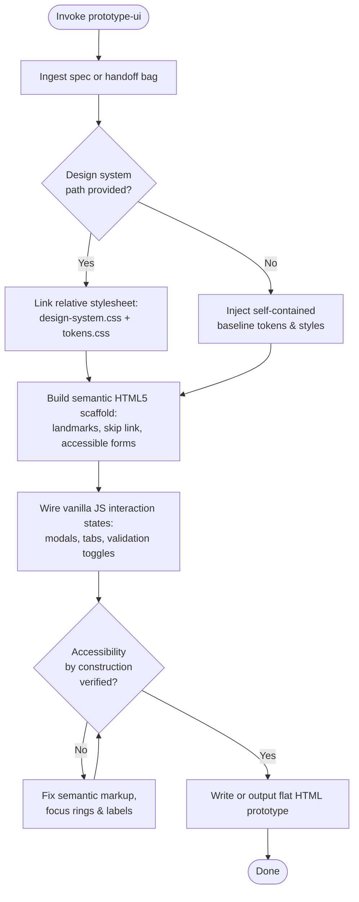

Generates standalone, browser-viewable flat HTML prototypes. Invocable directly for rapid ideation or spawned by `designer`.

**Accepts:** `[Handoff: Enriched]` from `designer` PHASE 2

| Field | Required? | Fallback if absent |
|---|---|---|
| screen_name | no | Inferred from prompt or argument hint |
| requirements_spec | no | Extracted from prompt or ephemeral baseline |
| design_system_path | no | Inlines self-contained fallback token styles |
| interaction_states | no | Generates default, active, error, and empty states |
| target_viewport | no | Defaults to fluid responsive (375px to 1440px) |

### Directives

1. **Self-Contained & Zero Build:**
   - Every prototype must open cleanly via direct filesystem navigation (`file://`) and local HTTP servers with zero build, bundling, or compilation steps.
   - Zero CDN dependencies: Use modern system font stacks (`system-ui, -apple-system, BlinkMacSystemFont, "Segoe UI", Roboto, sans-serif`) or local `@font-face` assets, relative local CSS links, and inline SVG or local relative sprite assets. Never inject remote Google Fonts or CDN stylesheets.

2. **Tailwind-Compatible Utilities & Semantic Classes:**
   - Use standard utility classes (`flex`, `grid`, `gap-*`, `p-*`, `m-*`, `rounded-*`, `shadow-*`, `text-*`, `bg-*`) and semantic component classes (`.btn`, `.btn-primary`, `.form-input`, `.modal`, `.card`, `.badge`).
   - When linked to a design system, reference `design-system.css` and `tokens.css`. When invoked standalone, inject an inline fallback block containing these core tokens and utilities.

3. **Semantic & Accessible by Construction:**
   - Use landmark elements: `<header>`, `<nav>`, `<main>`, `<aside>`, `<footer>`, `<section aria-labelledby="...">`.
   - Provide a top-level skip link: `<a href="#main-content" class="skip-link">Skip to main content</a>`.
   - Accessible Forms: Every input must have an explicit `<label for="...">`, associated `aria-describedby` for helper/error text, and `aria-invalid="true"` on error states.
   - Keyboard Navigation: Visible high-contrast `:focus-visible` outlines on all interactive elements. Escape key closes open dialogs/modals. Logical tab sequence.
   - Contrast Ratios: Minimum 4.5:1 for normal text, 3:1 for large text and UI boundaries against their backgrounds.

4. **Interaction & State Simulation:**
   - Implement interactive state switches (e.g. error banner toggle, modal open/close, tab panel switching, empty state simulation) using plain vanilla JavaScript (`addEventListener`).
   - For multi-screen flows, link screens via relative anchor tags (`href="./screen-02-summary.html"`).

5. **Output Location:**
   - When spawned by `designer`: Write to target path passed in handoff (e.g. `docs/design/drafts/<flow-name>/<screen-name>.html`).
   - When invoked directly: Write to `docs/design/drafts/adhoc/<screen-name>.html` (or display directly to user if repo has no design directory).
