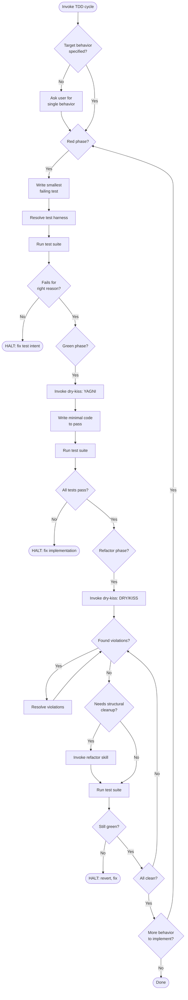

Never write production code before a failing test exists or refactor without a green suite. Each cycle: seconds or minutes.

### Red Phase — Write a failing test

- Write the smallest test for one behavior or edge case.
- Load `detect-test-harness`, run the suite, confirm the new test fails for the right reason (assertion failure, not syntax/import error). Tag `[Confidence: Level]`.
- HALT if test passes or fails for the wrong reason.

### Green Phase — Make it pass

- Load `dry-kiss`. Apply YAGNI: write the simplest code to pass. Hardcoded returns, "fake it 'til you make it", sub-optimal implementations permitted.
- Run the full suite. All tests must pass. HALT otherwise.

### Refactor Phase — Clean up

- Load `dry-kiss`. Evaluate for DRY/KISS violations.
- Resolve each violation. Loop until clean.
- If structural cleanup is needed: load `refactor` and delegate.
- Run the suite after every change. Revert and HALT if tests break.
- When clean: if more behavior remains, start a new cycle.

### Integration

- `dry-kiss` governs Green (YAGNI) and Refactor (DRY/KISS). Do not duplicate.
- `refactor` handles structural transformations, delegating to `dry-kiss` and `solid-principles` internally.
- `detect-test-harness` resolves the test runner. If unresolved: ask user.
- Never skip or combine phases. `[Policy: Enforced]`.