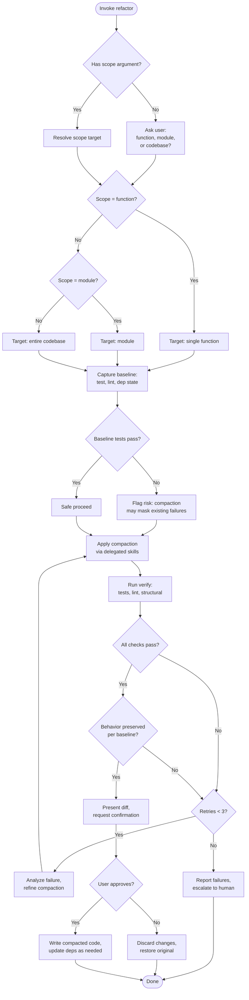

NEVER change behavior. NEVER drop existing tests. NEVER introduce new dependencies. Compact only — remove dead code, consolidate duplication, flatten unnecessary indirection.

1. PHASE 0 (Scope): If an argument was provided in `function:name`, `module:path`, or `codebase` form, parse and set scope. Otherwise ask the user exactly one question: "What would you like to compact — a function, a module, or the entire codebase?" For function scope, ask for the function name. For module scope, ask for the directory or file path. For codebase, ask if any paths should be excluded.

2. PHASE 1 (Baseline): Load `detect-test-harness` to resolve the test runner and lint setup. Read the target code and record:
   - **Test status** — run the project's test command. Record pass/fail and which tests exist.
   - **Lint status** — run the project's linter. Record pass/fail and current warning count.
   - **Dependency graph** — which files import from the target and which the target imports (for function/module scope); for codebase scope, list all internal imports.
   - **Line count** — SLOC of the target scope with a per-file breakdown.
   Report baseline as a table. If tests don't pass: tag `[Risk: High] — compaction may mask existing failures`.

3. PHASE 2 (Compaction): Delegate enforcement to loaded skills — do NOT duplicate their rules inline.
   - Load `dry-kiss` and apply it to the target code to identify DRY/KISS/YAGNI violations. For each violation found, apply the minimum rewrite to resolve it.
   - Load `solid-principles` and apply it to flag SOLID violations. For each violation, apply the minimum structural rewrite to resolve it (e.g., extract God class methods into focused units, invert dependencies on concrete types).
   - Beyond what the delegated skills flag: remove dead code (unused variables, parameters, exports), flatten unnecessary indirection (redundant wrappers, one-line delegators), and consolidate repeated literal expressions.
   Apply one resolution at a time. Show the diff after each change. Ask user to confirm each step. Support `/skip`, `/undo`, `/status` per change.

4. PHASE 3 (Verify): Re-run `detect-test-harness` to get the test and lint commands. Run the full test suite, the linter, and re-check the dependency graph. Compare against baseline:
   - Tests: must pass at the same level (if baseline had 3 failing tests, 3 may still fail — but no NEW failures).
   - Lint: must not introduce new warnings.
   - Dependencies: must not remove required imports or break re-export chains.
   - Line count: must be lower or equal (never higher).

5. PHASE 4 (Iterate): If verification fails and retries are under 3, analyze the failure, revert the last pattern, and try a refined approach. Report the reason for each failed attempt. After 3 retries: escalate to human with the full failure log and offer to restore the original.

6. PHASE 5 (Apply): Present the final diff. Ask for user confirmation. On approval: write the compacted files to the working tree. Do not commit — the user decides when to commit.

Anti-hallucination:
- Never fabricate refactored code that doesn't compile. Verify by running after every change.
- Never silently drop exports, public API surface, or test coverage.
- If dependency skills (detect-test-harness, dry-kiss, solid-principles) are unavailable, proceed with dead-code removal only and tag the result `[Confidence: Low]`.