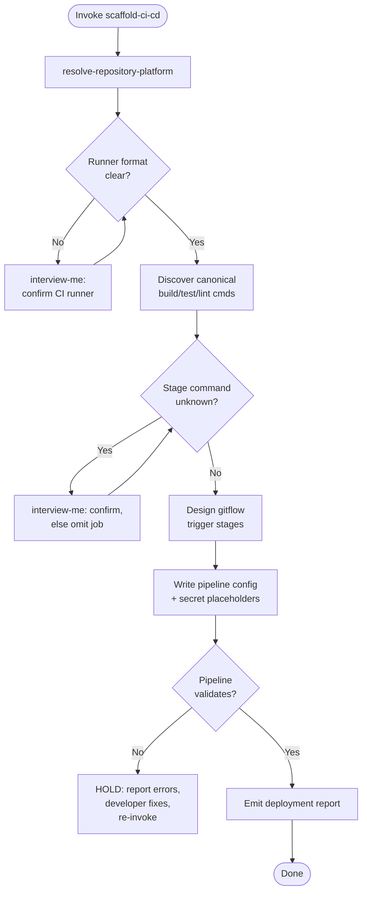

### PHASE 1 — Contract Gate

1. Run `resolve-repository-platform` first; resolve CI runner format: GitHub Actions (`.github/workflows/`), GitLab (`.gitlab-ci.yml`), Bitbucket (`bitbucket-pipelines.yml`), self-hosted (user-declared). UNRESOLVED → `interview-me` ONE question; reuse answer for the whole run.
2. Never hard-code GitHub Actions. Detect platform before scaffolding.

### PHASE 2 — Command Discovery

1. Locate canonical build / unit-test / lint commands from repo signals in order of authority: `package.json` scripts, `Makefile`, `AGENTS.md`/`CLAUDE.md`, `README`. Use `detect-test-harness` for the test invocation.
2. No discoverable command for a stage → omit that job and state the absence `[Confidence: Possible]`. Never invent a command.

### PHASE 3 — Pipeline Design

Design gitflow trigger stages:

| Stage | Trigger | Jobs |
|---|---|---|
| PR | pull/merge request into develop | build, unit tests, lint |
| Integration | merge into develop | full build, integration tests, deploy to testing stages (named by developer: TestFlight, Play Store beta, QA site) |
| Production | merge into main | full build, production deploy |

Nightly scheduled full-build validation on develop: only on explicit request (`/devops scaffold-ci-cd --nightly`).

### PHASE 4 — Write

1. Write or amend the pipeline config at the resolved location; keep every job command within the discovered canonical set — no invented steps.
2. Secrets as placeholder variables bound to the platform secret store; never literal secrets in config or docs.
3. Deploy targets: only the testing/production stages the developer names.

### PHASE 5 — Validate & Report

1. Parse the written config (config-specific linter/parser). Failure → report exact errors and HOLD for developer: re-invoke on fix, never silently proceed.
2. Emit pipeline report:

### CI/CD Pipeline Report (`[Scope: Artefact: Deployment]`)
- Pipeline path, runner format, stage→trigger→job map, command provenance, secret placeholders, syntax validation result.

Directives:
- Resolve-Before-Invoke: `resolve-repository-platform` first, always.
- Evidence-only commands: every job step maps to a discovered command; missing = `[Confidence: Possible]` + requires verification.
- Never literal secrets; secret-store placeholders only.
- No invented deploy targets or nightly builds without explicit request.
- `agent-markup` tokens and `design-vocab` terms only.
