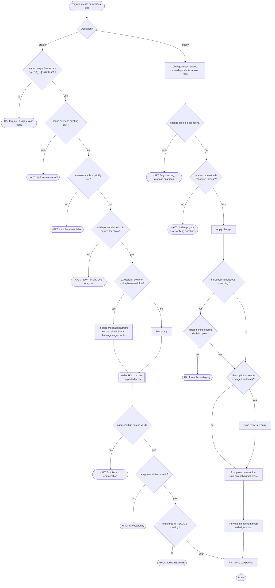

Gate every skill change (create or modify) through this workflow. Halt on any gate failure; fix before proceeding.

## Workflow

## Rules

Apply on every create or modify. Halt on violation; fix before proceeding.

| # | Rule | Detail |
|---|------|--------|
| 1 | **Naming & discovery** | Folder == `name`, matches `^[a-z0-9]+(-[a-z0-9]+)*$`, unique across repo. `SKILL.md` upper-case, flat under `skills/<name>/`, no sub-folders. |
| 2 | **Frontmatter minimum** | `name`, `description` (≤1024 chars, specific enough for runtime selection). `dependencies` always present (`[]` if none). `user-invocable` explicitly `true` or `false`. |
| 3 | **Dependency validation** | Every dep must exist as a folder under `skills/`. No circular chains. Orchestrators depend on leaves, never reverse. |
| 4 | **Scope gate** | One purpose per skill. Before adding behavior: verify it doesn't belong in a dependency or new leaf. Push back on scope creep. |
| 5 | **Prose compaction** | Strip every sentence that doesn't change what the agent *does*. No qualifiers, justifications, or restated definitions. Target: smallest token count preserving instruction completeness without introducing ambiguity. Run compaction after every modification. |
| 6 | **Mermaid gate** | Use Mermaid iff ≥2 branching decisions or multi-phase workflow. Pure contracts and single-path skills: prose only. All diagrams must satisfy the structural constraints in the Mermaid diagram rules section. |
| 7 | **Anti-hallucination** | Never reference non-existent files, skills, or documents. Instruct runtime validation with graceful fallback on absence. |
| 8 | **Output determinism** | Same inputs → structurally identical outputs. Eliminate "you may also" branches unless gated behind explicit deterministic decision. |
| 9 | **Markup & vocabulary** | All `[...]` tokens from `agent-markup` enumeration. All architecture terms from `design-vocab` taxonomy. No skill-invented tokens or synonyms. |
| 10 | **State persistence** | If persisting state: `${XDG_STATE_HOME:-$HOME/.local/state}/ai-skills/...`. Never working tree. Never temp. |
| 11 | **README registration** | New skills: add to README catalog under correct category. On modify: sync entry if description or scope changed. |
| 12 | **Challenge the human** | Reason whether request is fully thought through. Consider downstream impact. Prioritize anti-hallucination over compliance with incomplete request. |

## Mermaid diagram rules

Every diagram must satisfy these structural constraints. Halt on violation.

| # | Constraint | Detail |
|---|-----------|--------|
| 1 | **One question per diamond** | Every `{}` decision diamond asks exactly one question and has exactly two exit edges. Never stack multiple decisions in a single diamond. |
| 2 | **Flat sequential gates** | When logic has >2 outcomes, split into a sequential yes/no chain. Each gate peels off one path; the "No" edge falls through to the next gate. This eliminates overlapping loopback edges. |
| 3 | **No ungated process-node loops** | A loopback must pass through an explicit decision diamond that gates re-entry — it must be unambiguous what is skipped or repeated on the loop. Forward (non-loopback) process→process edges are permitted. |
| 4 | **Visible counters** | If a condition depends on accumulated state (e.g., "3rd attempt"), the counter must be a visible decision diamond (`COUNT{≥3?}`). Never bury counter logic in edge labels. |
| 5 | **All paths terminate or hold** | Every edge must reach a terminal leaf or a defined state-machine hold loop (e.g., `FORCE → FCHECK{Clear?} →|No| FORCE` — process routes to diamond, diamond "No" holds by looping back to same process). No dead-end edges missing a "No" path. |
| 6 | **Loopbacks land on diamonds** | Re-entry loopbacks target a diamond, not a process node. Hold-loop exemption: a diamond "No" edge may loop back to the immediately-preceding process node that feeds it (see Rule 5) — the diamond already gates re-exit. All other diamond→process loopbacks forbidden. |

## Compaction directive

After every SKILL.md modification, execute this compaction pass:
1. Remove any sentence that, if deleted, does not alter agent behavior.
2. Merge repeated constraints into a single canonical statement.
3. Replace multi-sentence explanations with a single imperative instruction.
4. Verify no instruction was lost or made ambiguous — if so, restore the minimum to resolve.
