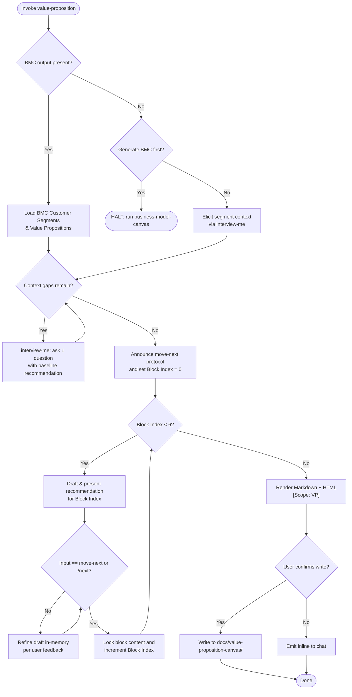

Cross-skill integration: load BMC context before prompting. NEVER re-ask what the BMC already provided. All 6 blocks (Customer Profile + Value Map) MUST exist in the output in fixed order to guarantee consistent schema. NEVER fabricate facts — unresolved fields stay empty.



1. PHASE 0 (Context Discovery & Gap Interview):
   - Resolve BMC output from `docs/business-model-canvas/` or supplied path. Extract **Customer Segments** and **Value Propositions**.
   - If BMC output is missing: ask ONE `interview-me` decision to generate with `business-model-canvas` first or elicit baseline segments interactively.
   - Inspect context for gaps across Customer Profile and Value Map dimensions.
   - For missing context: drive `interview-me` asking ONE question at a time, each with a calculated baseline recommendation, until shared understanding is reached.
   - Announce advancement protocol: answering questions or refining is NOT advancement. Only literal `move-next` or `/next` locks a section and advances.

2. PHASE 1 (Recommendation-Led Section Walkthrough):
   - Walk through the 6 blocks in fixed sequence across Customer Profile and Value Map.
   - For each block: present a synthesized, calculated recommendation draft tied directly to the BMC baseline.
   - User may critique, question, or request adjustments. Refine the draft in-memory. Answering or discussing does NOT advance.
   - Advance to next block ONLY when the user issues `move-next` or `/next`.
   - Support interactive commands: `move-next` / `/next`, `/back`, `/edit <block>`, `/done`, `/status`.

   Block sequence and definitions:
   **Customer Profile:**
   1. **Customer Jobs** — Functional, social, and emotional tasks target customers seek to accomplish.
   2. **Pains** — Undesired costs, risks, frustrations, and obstacles experienced around jobs.
   3. **Gains** — Expected, desired, or unexpected benefits and positive outcomes sought.

   **Value Map:**
   4. **Products & Services** — Specific products, features, and offerings that help execute jobs.
   5. **Pain Relievers** — Concrete mechanisms explaining how offerings eliminate or reduce specific customer pains.
   6. **Gain Creators** — Explicit ways offerings produce required, expected, or surprising customer gains.

3. PHASE 2 (Render): Compile the Value Proposition Canvas into two formats:
   - **Markdown** — structured document with Customer Profile and Value Map sections, each block as a sub-heading. Include imported BMC baseline as preamble. All 6 block sub-headings MUST be present.
   - **HTML** — self-contained page with inline styles rendering a two-column layout (Customer Profile | Value Map) with sub-block cards. All 6 block cards MUST be rendered. Tag `[Scope: VP]`.

4. PHASE 3 (Output): Present outputs. Offer to write to `docs/value-proposition-canvas/`. Do not write without explicit confirmation. Fallback: inline display.

Directives:
- Complete 6-Block Coverage: Every output canvas MUST contain all 6 blocks in fixed sequence to guarantee consistent schema and visual structure. Unanswered blocks render as "(not defined)".
- BMC-First: Establish BMC baseline before presenting first block recommendation.
- No Redundancy: Never ask the user to restate established BMC content. Reference it.
- Recommendation-First: Every section begins with the agent's drafted recommendation baseline based on discovered context.
- Strict Advancement: Advancing requires literal `move-next` or `/next`. Never auto-advance on conversational feedback.
- Anti-Fabrication: Unanswered blocks render as "(not defined)".
- Output Portability: HTML self-contained with inline styles. Markdown valid CommonMark.

Schema `[Scope: VP]`:

```
Input Context (from BMC):
  bmc.customer-segments  <string>
  bmc.value-propositions <string>

State (in-memory):
  vp.customer-jobs       <string>
  vp.pains               <string>
  vp.gains               <string>
  vp.products-services   <string>
  vp.pain-relievers      <string>
  vp.gain-creators       <string>
  current-block          <int 0-5>
```

```
Markdown Output:

# Value Proposition Canvas

## BMC Baseline
### Customer Segments
{bmc content}

### Value Propositions
{bmc content}

## Customer Profile
### Customer Jobs
{content}

### Pains
{content}

### Gains
{content}

## Value Map
### Products & Services
{content}

### Pain Relievers
{content}

### Gain Creators
{content}
```

```
HTML Output:
Self-contained <!DOCTYPE html> with inline-styled two-column layout.
Left column: Customer Profile (Customer Jobs, Pains, Gains as sub-cells).
Right column: Value Map (Products & Services, Pain Relievers, Gain Creators as sub-cells).
BMC baseline shown in a muted preamble row above the two columns.
Empty cells show "(not defined)" in muted text.
Tagged [Scope: VP].
```